Repository Summary:
Files analyzed: 25
Directories scanned: 679
Total size: 178.65 KB (182941 bytes)
Estimated tokens: 45735
Processing time: 3.57 seconds


## Table of Contents

- [Project Summary](#project-summary)
- [Directory Structure](#directory-structure)
- [Files Content](#files-content)
  - Files:
    - [.gitignore](#_gitignore)
    - [gemini-web-openai-proxy_flattened.md](#gemini-web-openai-proxy_flattened_md)
    - [ORIGINAL_REQUEST.md](#ORIGINAL_REQUEST_md)
    - [browser.ts](#browser_ts)
    - [connection.ts](#connection_ts)
    - [launcher.ts](#launcher_ts)
    - [mode-switcher.ts](#mode-switcher_ts)
    - [stream-listener.ts](#stream-listener_ts)
    - [tab-manager.ts](#tab-manager_ts)
    - [config.ts](#config_ts)
    - [index.ts](#index_ts)
    - [auto-repair.ts](#auto-repair_ts)
    - [reflection.ts](#reflection_ts)
    - [stream-lexer.ts](#stream-lexer_ts)
    - [registry.ts](#registry_ts)
    - [and 10 more files...]
- [Dependency Diagram](#dependency-diagram)

## Project Summary <a id="project-summary"></a>

# Project Digest: gemini-web-openai-proxy
Generated on: Sun Sep 06 2026 18:13:58 GMT+0100 (Irish Standard Time)
Source: w:\home\user\development\gemini-web-openai-proxy
Project Directory: w:\home\user\development\gemini-web-openai-proxy

# Directory Structure
[DIR] .
  [FILE] .gitignore
  [FILE] vitest.config.ts
  [DIR] .git
  [DIR] docs
    [FILE] ORIGINAL_REQUEST.md
  [DIR] dist
  [DIR] src
    [DIR] lexer
      [FILE] reflection.ts
      [FILE] stream-lexer.ts
      [FILE] auto-repair.ts
    [FILE] index.ts
    [DIR] prompt
      [FILE] tool-injector.ts
      [FILE] normalizer.ts
    [FILE] config.ts
    [DIR] models
      [FILE] registry.ts
    [DIR] cdp
      [FILE] connection.ts
      [FILE] browser.ts
      [FILE] stream-listener.ts
      [FILE] tab-manager.ts
      [FILE] launcher.ts
      [FILE] mode-switcher.ts
    [DIR] routes
      [FILE] models.ts
      [FILE] completions.ts
    [DIR] utils
      [FILE] sse.ts
      [FILE] mutex.ts
    [DIR] types
      [FILE] cdp.ts
      [FILE] openai.ts
  [FILE] tsconfig.json
  [DIR] node_modules
  [DIR] tests
  [DIR] CodeFlattened

# Files Content

## .gitignore <a id="_gitignore"></a>

```text
node_modules/
dist/
*.log
.env

```

## docs\ORIGINAL_REQUEST.md <a id="ORIGINAL_REQUEST_md"></a>

= Original User Request =

== Initial Request — 2026-09-04T03:29:54Z ==

This is a single self-contained fix; keep it small and focused. Implement MVP runtime hardening for the Gemini Web OpenAI Proxy to satisfy GitHub Issues #5 and #6 in a single feature branch and Pull Request, verified by clean compilation and live runtime browser benchmarks.

Working directory: w:/home/user/development/gemini-web-openai-proxy
Integrity mode: development

== Core Operational Directives ==
• Automated Unit Test Freeze: Testing is suspended until after Phase 4. DO NOT create new test files in tests/, DO NOT modify files in tests/, DO NOT run npm test or vitest.
• Authoritative Acceptance Criteria: The stated acceptance criteria are authoritative. Treat insertion mechanisms (Quill API, clipboard, execCommand) and DOM reconciliation strategies as implementation candidates; adjust strategy if runtime behavior disproves an assumption.
• Verification Method: Programmatic build check (npm run build) and live browser execution on port 9222.

== Requirements ==

=== R1. Resilient Stream Reconciliation (src/cdp/stream-listener.ts) — GitHub Issue #5 ===
• Replace strict currentText.startsWith(lastText) with a resilient matching mechanism (lookback suffix anchor, structural non-whitespace alignment, and transient mutation debouncing/settling) to prevent false-positive DOM rewrite detected; stream discontinuity aborts during code block emission, <pre><code> reflow, syntax highlighting, and whitespace normalization.
• Normalize CRLF line-endings (\r\n -> \n) across DOM extractions.

=== R2. Large Context Input & Submit Hardening (src/cdp/browser.ts, src/config.ts) — GitHub Issue #6 ===
• Implement safe prompt insertion into .ql-editor supporting up to 30k tokens. Fallback hierarchy: model-aware bulk insertion via Quill API → synthetic clipboard paste → execCommand('insertText') → last-resort DOM mutation with editor state verification.
• Actively trigger DOM input/change events to wake Angular change detection.
• Add configurable submitTimeoutMs (default: 20000ms) in src/config.ts and harden submit button usability polling loop to accommodate heavy DOM layout computation without premature timeout.
• Ensure escape safety: preserve quotes (", '), backslashes (\, \\), newlines, and XML delimiters (<toolcall>, </toolcall>) byte-for-byte.

=== R3. Git Feature Branch & Pull Request Delivery ===
• Develop on a dedicated feature branch: feature/mvp-opencode-cdp-hardening.
• Commit changes with conventional commits.
• Push to origin and open a Pull Request linking:
• Closes https://github.com/kyleobrien91/gemini-web-openai-proxy/issues/5
• Closes https://github.com/kyleobrien91/gemini-web-openai-proxy/issues/6
• Cross-reference Vikunja Project #5 Tasks #15 and #16.

== Acceptance Criteria ==

=== Compilation & Static Typing ===
• [ ] npm run build passes with zero TypeScript errors.

=== Issue #5: Large Code Output Streaming ===
• [ ] Prompt demanding 100+ lines of Python code streams to completion ending with [DONE] without triggering DOM rewrite detected; stream discontinuity.
• [ ] Prompt demanding 100+ lines of TypeScript code streams to completion ending with [DONE] without triggering DOM rewrite detected; stream discontinuity.
• [ ] Generated code preserves valid syntax and block formatting.

=== Issue #6: Benchmarking & Escape Safety (Report Exact Calculated Token Counts) ===
• [ ] Escape Safety Payload: Complex payload containing unescaped single/double quotes, backslashes, XML tags (<tool_call>), and nested JSON survives insertion byte-for-byte; submit button activates cleanly.
• [ ] 10k Token Benchmark: Realistic multi-file code context (~10k calculated tokens) is inserted without tab freeze and submit button becomes usable within < 3 seconds.
• [ ] 20k Token Benchmark: Realistic multi-file code context (~20k calculated tokens) is inserted and submit button becomes usable within < 6 seconds.
• [ ] 30k Token Benchmark: Realistic multi-file code context (~30k calculated tokens) is inserted without script evaluation lag and submit button becomes usable within < 12 seconds (no timeout).
## vitest.config.ts <a id="vitest_config_ts"></a>

### Dependencies

- `vitest/config`

```typescript
import { defineConfig } from 'vitest/config';

export default defineConfig({
  test: {
    globals: true,
    environment: 'node',
  },
});

```

## src\lexer\reflection.ts <a id="reflection_ts"></a>

```typescript
export function generateReflectionPrompt(errorReason: string): string {
    return `[SYSTEM CORRECTION]:
Your previous response violated the mandatory tool calling format.
Reason: ${errorReason}

You MUST immediately re-output your response strictly using:
<tool_call>
{"name": "exact_tool_name", "arguments": { ... }}
</tool_call>
Do not add commentary, output only the valid tool call.`;
}

```

## src\lexer\auto-repair.ts <a id="auto-repair_ts"></a>

### Dependencies

- `json5`

```typescript
import JSON5 from 'json5';

export function stripMarkdown(text: string): string {
  // Strip markdown code blocks surrounding tool calls
  const mdRegex = /^```(?:json|xml)?\s*([\s\S]*?)```\s*$/i;
  const match = text.trim().match(mdRegex);
  if (match) {
    return match[1].trim();
  }
  return text.trim();
}

export function fuzzyTagRepair(text: string): string {
  let repaired = text;

  // Repair fuzzy tags to <tool_call>
  repaired = repaired.replace(/<tool-call>/g, '<tool_call>')
                     .replace(/<\/tool-call>/g, '</tool_call>')
                     .replace(/<tool>/g, '<tool_call>')
                     .replace(/<\/tool>/g, '</tool_call>')
                     .replace(/<function_call>/g, '<tool_call>')
                     .replace(/<\/function_call>/g, '</tool_call>');

  // Repair tags with attributes
  repaired = repaired.replace(/<tool_call[^>]*>/g, '<tool_call>');

  // Check if there is an unclosed tag at the end
  if (repaired.includes('<tool_call>') && !repaired.includes('</tool_call>')) {
      repaired += '\n</tool_call>';
  }

  return repaired;
}

export function tryParseJSON(jsonStr: string): any {
  try {
    return JSON.parse(jsonStr);
  } catch (e) {
    try {
      return JSON5.parse(jsonStr);
    } catch (e2) {
      return null;
    }
  }
}

```

## src\index.ts <a id="index_ts"></a>

### Dependencies

- `express`
- `cors`
- `./config.js`
- `./routes/models.js`
- `./routes/completions.js`
- `./cdp/browser.js`

```typescript
import express from 'express';
import cors from 'cors';
import { config } from './config.js';
import modelsRouter from './routes/models.js';
import completionsRouter from './routes/completions.js';
import { browserWorker } from './cdp/browser.js';

const app = express();

app.use(cors());
app.use(express.json());

// Request logging middleware
app.use((req, res, next) => {
  console.log(`[${new Date().toISOString()}] ${req.method} ${req.url}`);
  next();
});

// Routes
app.use(modelsRouter);
app.use(completionsRouter);

// Error handler
app.use((err: any, req: express.Request, res: express.Response, next: express.NextFunction) => {
  console.error('Unhandled error:', err);
  res.status(500).json({ error: { message: 'Internal server error' } });
});

app.listen(config.port, async () => {
  console.log(`Gemini Web OpenAI Proxy listening on port ${config.port}`);
  console.log(`- Local URL: http://localhost:${config.port}`);
  console.log(`- CDP Target: http://${config.cdpHost}:${config.cdpPort}`);

  if (config.autoLaunchBrowser) {
    try {
      await browserWorker.ensureReady();
    } catch (err) {
      console.error('[Browser Launcher] Failed to initialize browser session:', err);
    }
  }
});


```

## src\lexer\stream-lexer.ts <a id="stream-lexer_ts"></a>

### Dependencies

- `uuid`
- `./auto-repair.js`
- `../types/openai.js`
- `ajv`

```typescript
import { v4 as uuidv4 } from 'uuid';
import { fuzzyTagRepair, stripMarkdown, tryParseJSON } from './auto-repair.js';
import { Tool } from '../types/openai.js';

// @ts-ignore
import AjvModule from 'ajv';
// @ts-ignore
const Ajv = AjvModule.default || AjvModule;

const ajv = new Ajv({ strict: false, coerceTypes: true });

export interface LexerOptions {
  allowedTools?: Tool[];
  onContent: (content: string) => void;
  onToolCallStart: (index: number, id: string, name: string) => void;
  onToolCallArg: (index: number, argFragment: string) => void;
  onToolCallEnd: (index: number) => void;
  onFinished: (reason: 'stop' | 'tool_calls') => void;
  onPushbackRequest?: (reason: string) => void;
}

type LexerState = 'TEXT' | 'IN_TOOL_CALL' | 'FAILED';

const OPENER_TAGS = ['<tool_call>', '<tool-call>', '<tool>', '<function_call>'];
const CLOSING_TAGS = ['</tool_call>', '</tool-call>', '</tool>', '</function_call>'];

export class StreamLexer {
  private buffer = '';
  private scanIndex = 0;
  private stringQuote = '';
  private escapeNext = false;

  private toolCallIndex = 0;
  private currentToolId = '';
  private options: LexerOptions;
  private hasEmittedTool = false;
  private state: LexerState = 'TEXT';

  // Opener FSM State
  private openerState = 0;
  private openerMatchedText = '';
  private openerTagMatchLen = 0;
  private openerCandidates = OPENER_TAGS;
  private openerLangWord = '';

  // Closer FSM State
  private closeState = 0;
  private closeTagMatchLen = 0;
  private closeCandidates = CLOSING_TAGS;
  private closeMatchLength = 0;
  private closeMatchStartIndex = -1;

  constructor(options: LexerOptions) {
    this.options = options;
  }

  processChunk(chunk: string) {
    if (this.state === ('FAILED' as any)) return;
    for (const c of chunk) {
        if (this.state === 'TEXT') {
            this.processTextChar(c);
        } else if (this.state === 'IN_TOOL_CALL') {
            this.buffer += c;
            this.processToolCallChar(c);
        }
    }
  }

  private processTextChar(c: string) {
     const cLower = c.toLowerCase();
     this.openerMatchedText += c;

     let failed = false;

     if (this.openerState === 0) {
         if (c === '\n') { this.openerState = 1; }
         else if (c === '`') { this.openerState = 2; }
         else if (c === '<') { this.openerState = 9; this.openerTagMatchLen = 1; this.openerCandidates = OPENER_TAGS; }
         else {
             this.options.onContent(c);
             this.openerMatchedText = '';
             return;
         }
     } else if (this.openerState === 1) {
         if (c === '`') { this.openerState = 2; }
         else if (c === '<') { this.openerState = 9; this.openerTagMatchLen = 1; this.openerCandidates = OPENER_TAGS; }
         else { failed = true; }
     } else if (this.openerState === 2) {
         if (c === '`') { this.openerState = 3; }
         else { failed = true; }
     } else if (this.openerState === 3) {
         if (c === '`') { this.openerState = 4; }
         else { failed = true; }
     } else if (this.openerState === 4) {
         if (c === '\n') { this.openerState = 8; }
         else if (c === '<') { this.openerState = 9; this.openerTagMatchLen = 1; this.openerCandidates = OPENER_TAGS; }
         else if (c === ' ' || c === '\t') { this.openerState = 7; }
         else if (/[a-z]/i.test(c)) { this.openerState = 5; this.openerLangWord = cLower; }
         else { failed = true; }
     } else if (this.openerState === 5) {
         if (/[a-z]/i.test(c)) {
             this.openerLangWord += cLower;
             if (!"xml".startsWith(this.openerLangWord) && !"json".startsWith(this.openerLangWord)) {
                 failed = true;
             }
         } else if (c === ' ' || c === '\t') {
             if (this.openerLangWord === 'xml' || this.openerLangWord === 'json') { this.openerState = 7; }
             else { failed = true; }
         } else if (c === '\n') {
             if (this.openerLangWord === 'xml' || this.openerLangWord === 'json') { this.openerState = 8; }
             else { failed = true; }
         } else if (c === '<') {
             if (this.openerLangWord === 'xml' || this.openerLangWord === 'json') { this.openerState = 9; this.openerTagMatchLen = 1; this.openerCandidates = OPENER_TAGS; }
             else { failed = true; }
         } else {
             failed = true;
         }
     } else if (this.openerState === 7) {
         if (c === ' ' || c === '\t') { /* stay */ }
         else if (c === '\n') { this.openerState = 8; }
         else if (c === '<') { this.openerState = 9; this.openerTagMatchLen = 1; this.openerCandidates = OPENER_TAGS; }
         else { failed = true; }
     } else if (this.openerState === 8) {
         if (c === '<') { this.openerState = 9; this.openerTagMatchLen = 1; this.openerCandidates = OPENER_TAGS; }
         else { failed = true; }
     } else if (this.openerState === 9) {
         this.openerCandidates = this.openerCandidates.filter(t => t[this.openerTagMatchLen] === cLower);
         if (this.openerCandidates.length > 0) {
             this.openerTagMatchLen++;
             if (this.openerCandidates.some(t => t.length === this.openerTagMatchLen)) {
                 // MATCHED!
                 const leadingNewline = this.openerMatchedText.startsWith('\n') ? '\n' : '';
                 if (leadingNewline) {
                     this.options.onContent(leadingNewline);
                 }
                 const matchWithoutNewline = leadingNewline ? this.openerMatchedText.substring(1) : this.openerMatchedText;

                 this.state = 'IN_TOOL_CALL';
                 this.buffer = matchWithoutNewline;

                 this.openerState = 0;
                 this.openerMatchedText = '';

                 this.scanIndex = this.buffer.length;
                 this.stringQuote = '';
                 this.escapeNext = false;
                 this.closeState = 0;
                 return;
             }
         } else {
             failed = true;
         }
     }

     if (failed) {
         this.options.onContent(this.openerMatchedText.slice(0, -1));
         this.openerState = 0;
         this.openerMatchedText = '';
         this.processTextChar(c);
     }
  }

  private processToolCallChar(c: string) {
      this.scanIndex++;

      if (this.buffer.length > 100000) {
          if (this.options.onPushbackRequest) {
              this.options.onPushbackRequest("Generated tool call exceeded maximum token length without closing tag. Please provide concise output.");
          }
          this.buffer = '';
          this.state = 'FAILED';
          return;
      }

      if (this.escapeNext) { this.escapeNext = false; return; }
      if (c === '\\') { this.escapeNext = true; return; }
      if (this.stringQuote !== '') {
          if (c === this.stringQuote) this.stringQuote = '';
          return;
      }
      if (c === '"' || c === "'") {
          this.stringQuote = c;
          return;
      }

      const cLower = c.toLowerCase();
      let failed = false;

      if (this.closeState === 0) {
          if (c === '<') {
              this.closeState = 1;
              this.closeTagMatchLen = 1;
              this.closeCandidates = CLOSING_TAGS;
              this.closeMatchLength = 1;
              this.closeMatchStartIndex = this.scanIndex - 1;
          }
      } else if (this.closeState === 1) {
          this.closeCandidates = this.closeCandidates.filter(t => t[this.closeTagMatchLen] === cLower);
          if (this.closeCandidates.length > 0) {
              this.closeTagMatchLen++;
              this.closeMatchLength++;
              if (this.closeCandidates.some(t => t.length === this.closeTagMatchLen)) {
                  this.closeState = 2; // Tag matched!
              }
          } else {
              failed = true;
          }
      } else if (this.closeState === 2) {
          if (c === ' ' || c === '\t') { this.closeMatchLength++; }
          else if (c === '\n') { this.closeState = 3; this.closeMatchLength++; }
          else if (c === '`') { this.closeState = 4; this.closeMatchLength++; }
          else {
              this.handleToolCallClose(this.closeMatchStartIndex, this.closeMatchLength);
              return;
          }
      } else if (this.closeState === 3) {
          if (c === '`') { this.closeState = 4; this.closeMatchLength++; }
          else { this.handleToolCallClose(this.closeMatchStartIndex, this.closeMatchLength); return; }
      } else if (this.closeState === 4) {
          if (c === '`') { this.closeState = 5; this.closeMatchLength++; }
          else { this.handleToolCallClose(this.closeMatchStartIndex, this.closeMatchLength); return; }
      } else if (this.closeState === 5) {
          if (c === '`') {
              this.closeMatchLength++;
              this.handleToolCallClose(this.closeMatchStartIndex, this.closeMatchLength);
              return;
          }
          else { this.handleToolCallClose(this.closeMatchStartIndex, this.closeMatchLength); return; }
      }

      if (failed) {
          this.closeState = c === '<' ? 1 : 0;
          this.closeTagMatchLen = c === '<' ? 1 : 0;
          this.closeCandidates = CLOSING_TAGS;
          this.closeMatchLength = c === '<' ? 1 : 0;
          if (c === '<') this.closeMatchStartIndex = this.scanIndex - 1;
      }
  }

  private handleToolCallClose(closeIndex: number, closeLength: number) {
      const fullToolCall = this.buffer.substring(0, closeIndex + closeLength);
      this.processBufferedToolCall(fullToolCall);

      if (this.state === 'FAILED') {
          this.buffer = '';
          return;
      }

      const remainder = this.buffer.substring(closeIndex + closeLength);
      this.buffer = '';
      this.state = 'TEXT';

      for (const c of remainder) {
          this.processTextChar(c);
      }
  }

  private processBufferedToolCall(rawText: string) {
    let contentToParse = rawText;
    contentToParse = fuzzyTagRepair(contentToParse);
    contentToParse = stripMarkdown(contentToParse);

    const match = contentToParse.match(/<tool_call>([\s\S]*?)<\/tool_call>/);
    if (!match) {
        if (this.options.onPushbackRequest) {
            this.options.onPushbackRequest("The tool call format was invalid. Please ensure it is wrapped in <tool_call> tags.");
        }
        this.state = 'FAILED';
        this.buffer = '';
        return;
    }

    const jsonStr = match[1].trim();
    const parsed = tryParseJSON(jsonStr);

    if (parsed && typeof parsed === 'object' && parsed.name) {
      let matchedTool: Tool | undefined;
      if (this.options.allowedTools && this.options.allowedTools.length > 0) {
          matchedTool = this.options.allowedTools.find(t => t.function.name === parsed.name);
          if (!matchedTool) {
               if (this.options.onPushbackRequest) {
            this.options.onPushbackRequest(`You attempted to call an unknown tool: '${parsed.name}'. Please only use tools from the provided schema.`);
        }
        this.state = 'FAILED';
        this.buffer = '';
        return;
          }
      } else {
         if (this.options.onPushbackRequest) {
            this.options.onPushbackRequest(`You attempted to call a tool ('${parsed.name}'), but no tools are available. Please respond with regular text.`);
        }
        this.state = 'FAILED';
        this.buffer = '';
        return;
      }

      if (parsed.arguments && typeof parsed.arguments !== 'object') {
           if (this.options.onPushbackRequest) {
            this.options.onPushbackRequest(`The arguments for tool '${parsed.name}' must be a valid JSON object.`);
        }
        this.state = 'FAILED';
        this.buffer = '';
        return;
      }

      if (matchedTool?.function?.parameters) {
          try {
              const validate = ajv.compile(matchedTool.function.parameters);
              const valid = validate(parsed.arguments || {});
              if (!valid) {
                  const errorMsg = ajv.errorsText(validate.errors);
                  if (this.options.onPushbackRequest) {
            this.options.onPushbackRequest(`Schema validation failed for tool '${parsed.name}': ${errorMsg}`);
        }
        this.state = 'FAILED';
        this.buffer = '';
        return;
              }
          } catch (e: any) {
              console.error("AJV compilation/validation error:", e);
              if (this.options.onPushbackRequest) {
            this.options.onPushbackRequest(`Internal schema compilation failed for tool '${parsed.name}'. Check tool schema.`);
        }
        this.state = 'FAILED';
        this.buffer = '';
        return;
          }
      }

      this.currentToolId = `call_${uuidv4().replace(/-/g, '').substring(0, 16)}`;
      this.options.onToolCallStart(this.toolCallIndex, this.currentToolId, parsed.name);

      const argsStr = JSON.stringify(parsed.arguments || {});
      this.options.onToolCallArg(this.toolCallIndex, argsStr);
      this.options.onToolCallEnd(this.toolCallIndex);
      this.toolCallIndex++;
      this.hasEmittedTool = true;
    } else {
      if (this.options.onPushbackRequest) {
          this.options.onPushbackRequest("The JSON inside <tool_call> was malformed or missing the required 'name' property.");
      }
      this.state = 'FAILED';
      this.buffer = '';
      return;
    }
  }

  finish() {
    if (this.state === ('FAILED' as any)) return;

    if (this.state === 'IN_TOOL_CALL') {
        if (this.closeState >= 2) {
             // We were matching trailing markdown, but the tool call tag itself is complete!
             this.handleToolCallClose(this.closeMatchStartIndex, this.closeMatchLength);
        } else if (this.buffer.length > 0) {
             this.processBufferedToolCall(this.buffer);
             this.buffer = '';
        }
    } else if (this.state === 'TEXT' && this.openerMatchedText.length > 0) {
        this.options.onContent(this.openerMatchedText);
        this.openerMatchedText = '';
    }

    if (this.state !== 'FAILED') {
        this.options.onFinished(this.hasEmittedTool ? 'tool_calls' : 'stop');
    }
  }
}

```

## src\config.ts <a id="config_ts"></a>

### Dependencies

- `dotenv`
- `path`
- `os`

```typescript
import dotenv from 'dotenv';
import path from 'path';
import os from 'os';

dotenv.config();

export const config = {
  port: parseInt(process.env.PORT || '8000', 10),
  cdpHost: process.env.CDP_HOST || '127.0.0.1',
  cdpPort: parseInt(process.env.CDP_PORT || '9222', 10),
  requestTimeoutMs: parseInt(process.env.REQUEST_TIMEOUT_MS || '60000', 10),
  maxRetries: parseInt(process.env.MAX_RETRIES || '2', 10),
  autoLaunchBrowser: process.env.AUTO_LAUNCH_BROWSER !== 'false',
  chromePath: process.env.CHROME_PATH || '',
  chromeUserDataDir: process.env.CHROME_USER_DATA_DIR || path.join(os.homedir(), '.gemini-web-openai-proxy', 'chrome-profile'),
  keepBrowserOpenOnExit: process.env.KEEP_BROWSER_OPEN_ON_EXIT === 'true',
};


```

## src\prompt\normalizer.ts <a id="normalizer_ts"></a>

### Dependencies

- `../types/openai.js`
- `./tool-injector.js`
- `../lexer/auto-repair.js`

```typescript
import { ChatCompletionRequest } from '../types/openai.js';
import { injectToolSchemas } from './tool-injector.js';
import { tryParseJSON } from '../lexer/auto-repair.js';

export function normalizeMessages(request: ChatCompletionRequest): string {
  const { messages, tools } = request;
  let flattenedPrompt = '';

  // 1. System Messages
  const systemMessages = messages.filter(m => m.role === 'system');
  if (systemMessages.length > 0) {
    flattenedPrompt += `### System Instructions:\n`;
    for (const msg of systemMessages) {
      if (msg.content) {
        flattenedPrompt += `${msg.content}\n\n`;
      }
    }
  }

  // 2. Tool Schema Injection
  if (tools && tools.length > 0) {
    flattenedPrompt += injectToolSchemas(tools) + '\n\n';
  }

  // 3. Multi-Turn History
  const historyMessages = messages.filter(m => m.role !== 'system');
  if (historyMessages.length > 0) {
    flattenedPrompt += `### Conversation History:\n`;
    for (let i = 0; i < historyMessages.length - 1; i++) {
        const msg = historyMessages[i];
        if (msg.role === 'user') {
            flattenedPrompt += `[User]:\n${msg.content}\n\n`;
        } else if (msg.role === 'assistant') {
            flattenedPrompt += `[Assistant]:\n`;
            if (msg.content) {
                flattenedPrompt += `${msg.content}\n`;
            }
            if (msg.tool_calls && msg.tool_calls.length > 0) {
                flattenedPrompt += `[Assistant Tool Calls]:\n`;
                for (const toolCall of msg.tool_calls) {
                    if (toolCall.function) {
                        let parsedArgs = toolCall.function.arguments;
                        // Prevent double JSON encoding
                        if (typeof parsedArgs === 'string') {
                             const parsed = tryParseJSON(parsedArgs);
                             if (parsed) {
                                 parsedArgs = parsed;
                             }
                        }

                        flattenedPrompt += `<tool_call>\n${JSON.stringify({id: toolCall.id, name: toolCall.function.name, arguments: parsedArgs})}\n</tool_call>\n`;
                    }
                }
            }
            flattenedPrompt += `\n`;
        } else if (msg.role === 'tool') {
             flattenedPrompt += `[Tool Result]:\ntool_call_id: ${msg.tool_call_id || 'unknown'}\n${msg.content}\n\n`;
        }
    }

    // The last message is the current instruction
    const lastMsg = historyMessages[historyMessages.length - 1];
    if (lastMsg) {
         flattenedPrompt += `### Current Instruction:\n`;
         if (lastMsg.role === 'user') {
             flattenedPrompt += `[User]:\n${lastMsg.content}\n\n`;
         } else if (lastMsg.role === 'tool') {
             // Edge case where a tool result is the last message
             flattenedPrompt += `[Tool Result]:\ntool_call_id: ${lastMsg.tool_call_id || 'unknown'}\n${lastMsg.content}\n\nPlease proceed based on the tool result above.\n\n`;
         }
    }
  }

  return flattenedPrompt.trim();
}

```

## src\prompt\tool-injector.ts <a id="tool-injector_ts"></a>

### Dependencies

- `../types/openai.js`

```typescript
import { Tool } from '../types/openai.js';

export function injectToolSchemas(tools?: Tool[]): string {
  if (!tools || tools.length === 0) {
    return '';
  }

  const toolDefinitions = tools.map(t => t.function);

  return `
[AVAILABLE TOOLS]
The following tools are available for you to execute tasks:
${JSON.stringify(toolDefinitions, null, 2)}

[TOOL CALL INSTRUCTIONS]
If you decide to invoke one or more tools, you MUST output the tool call strictly wrapped inside <tool_call> and </tool_call> tags with valid JSON matching the schema:

<tool_call>
{"name": "tool_name_here", "arguments": {"param_key": "param_value"}}
</tool_call>

Rules:
1. Tool names must exactly match supplied tools.
2. Arguments must be valid JSON and strictly conform to the supplied schema.
3. Multiple tool calls are allowed where appropriate.
4. Tool calls must not be wrapped in Markdown fences (e.g., no \`\`\`json or \`\`\`xml).
5. Normal text may be emitted when no tool is required, or as explanation before/after tool calls. TEXT MUST NOT APPEAR INSIDE OR BETWEEN THE <tool_call> AND </tool_call> TAGS (other than the JSON).
`;
}

```

## src\cdp\connection.ts <a id="connection_ts"></a>

### Dependencies

- `ws`
- `../types/cdp.js`
- `../config.js`

```typescript
import WebSocket from 'ws';
import { CDPTarget, CDPMessage } from '../types/cdp.js';
import { config } from '../config.js';

export class CDPConnection {
  private ws: WebSocket | null = null;
  private messageId = 1;
  private pendingRequests = new Map<number, { resolve: (val: any) => void; reject: (err: any) => void }>();
  private eventListeners = new Map<string, Set<(params: any) => void>>();
  private disconnectListeners: Set<() => void> = new Set();
  public targetId: string | null = null;

  async discoverTarget(): Promise<CDPTarget> {
    const response = await fetch(`http://${config.cdpHost}:${config.cdpPort}/json`);
    if (!response.ok) {
      throw new Error(`Failed to discover targets: ${response.statusText}`);
    }
    const targets: CDPTarget[] = await response.json();

    let target: CDPTarget | undefined;

    if (this.targetId) {
        target = targets.find(t => t.id === this.targetId);
        if (!target) {
            this.targetId = null;
        }
    }

    if (!target) {
        target = targets.find(t => t.url.includes('gemini.google.com/app'));

        if (!target) {
            const newTabRes = await fetch(`http://${config.cdpHost}:${config.cdpPort}/json/new?https://gemini.google.com/app`, { method: 'PUT' });
            if (newTabRes.ok) {
                 target = await newTabRes.json();
            }
        }
    }

    if (!target) {
      throw new Error('No active Gemini target found and failed to create one. Please authenticate Gemini in your browser.');
    }

    this.targetId = target.id;
    return target;
  }

  async connect(debuggerUrl: string): Promise<void> {
    if (this.ws && this.ws.readyState === WebSocket.OPEN) {
        return;
    }

    return new Promise((resolve, reject) => {
      this.ws = new WebSocket(debuggerUrl);

      this.ws.on('open', async () => {
        // Explicitly enable Page domain and propagate failure to reject connection
        try {
            await this.send('Page.enable');
            resolve();
        } catch (e) {
            this.disconnect();
            reject(new Error(`Failed to enable Page domain during CDP connection: ${e}`));
        }
      });

      this.ws.on('message', (data: WebSocket.RawData) => {
        const msg = JSON.parse(data.toString()) as CDPMessage;
        if (msg.id !== undefined && this.pendingRequests.has(msg.id)) {
          const { resolve, reject } = this.pendingRequests.get(msg.id)!;
          this.pendingRequests.delete(msg.id);
          if (msg.error) {
            reject(msg.error);
          } else {
            const result = msg.result;
            if (result && typeof result === 'object' && result.result && 'value' in result.result && !('value' in result)) {
              result.value = result.result.value;
            }
            resolve(result);
          }
        } else if (msg.method) {
          const listeners = this.eventListeners.get(msg.method);
          if (listeners) {
            listeners.forEach(fn => fn(msg.params));
          }
        }
      });

      this.ws.on('error', (err) => {
        this.rejectAllPending(err);
        this.notifyDisconnect();
        reject(err);
      });

      this.ws.on('close', () => {
        this.ws = null;
        this.rejectAllPending(new Error("CDP WebSocket closed"));
        this.notifyDisconnect();
      });
    });
  }

  private rejectAllPending(err: any) {
     for (const [id, req] of this.pendingRequests.entries()) {
         req.reject(err);
         this.pendingRequests.delete(id);
     }
  }

  private notifyDisconnect() {
     for (const listener of this.disconnectListeners) {
         listener();
     }
  }

  onDisconnect(listener: () => void) {
     this.disconnectListeners.add(listener);
  }

  offDisconnect(listener: () => void) {
     this.disconnectListeners.delete(listener);
  }

  async send(method: string, params: any = {}): Promise<any> {
    if (!this.ws || this.ws.readyState !== WebSocket.OPEN) {
      throw new Error('WebSocket is not connected');
    }

    const id = this.messageId++;
    return new Promise((resolve, reject) => {
      this.pendingRequests.set(id, { resolve, reject });
      this.ws!.send(JSON.stringify({ id, method, params }));
    });
  }

  on(method: string, callback: (params: any) => void) {
    if (!this.eventListeners.has(method)) {
      this.eventListeners.set(method, new Set());
    }
    this.eventListeners.get(method)!.add(callback);
  }

  off(method: string, callback: (params: any) => void) {
    const listeners = this.eventListeners.get(method);
    if (listeners) {
      listeners.delete(callback);
    }
  }

  disconnect() {
    if (this.ws) {
      this.ws.close();
      this.ws = null;
    }
  }
}

```

## src\cdp\mode-switcher.ts <a id="mode-switcher_ts"></a>

### Dependencies

- `./connection.js`
- `../models/registry.js`

```typescript
import { CDPConnection } from './connection.js';
import { getModel, resolveTargetModel, modelRegistry } from '../models/registry.js';

export class ModeSwitcher {
  private cdp: CDPConnection;

  constructor(cdp: CDPConnection) {
    this.cdp = cdp;
  }

  async switchMode(modelName: string): Promise<void> {
    const targetModel = resolveTargetModel(modelName);
    if (!targetModel) {
      throw new Error(`Unknown model: ${modelName}. Supported models are: ${Object.keys(modelRegistry).join(', ')}.`);
    }

    if (targetModel.id === 'default') {
      return; // Keep current UI selection
    }

    const testId = targetModel.webDomTestId || '';
    const targetModelId = targetModel.id;
    const targetExtendedThinking = targetModel.extendedThinking;

    const script = `
      (async function() {
        function findMenuButton() {
          return document.querySelector('button[data-test-id="bard-mode-menu-button"], button.input-area-switch, button[aria-label*="mode picker"], button[aria-label*="Mode picker"]');
        }
        let menuBtn = findMenuButton();
        if (!menuBtn) {
          const start = Date.now();
          while (Date.now() - start < 8000) {
            menuBtn = findMenuButton();
            if (menuBtn) break;
            await new Promise(r => setTimeout(r, 200));
          }
        }
        if (!menuBtn) return "MENU_NOT_FOUND";

        const currentText = menuBtn.innerText.toLowerCase();
        const currentAria = (menuBtn.getAttribute('aria-label') || '').toLowerCase();
        const currentHasExtended = currentText.includes('extended') || currentAria.includes('extended');

        let currentBaseModel = 'unknown';
        if (currentText.includes('lite') || currentAria.includes('lite')) currentBaseModel = 'gemini-flash-lite';
        else if (currentText.includes('flash') || currentAria.includes('flash')) currentBaseModel = 'gemini-flash';
        else if (currentText.includes('pro') || currentAria.includes('pro')) currentBaseModel = 'gemini-pro';

        const target = ${JSON.stringify(targetModelId)};
        let targetBaseModel = target;
        if (target.includes('flash-lite')) targetBaseModel = 'gemini-flash-lite';
        else if (target.includes('flash')) targetBaseModel = 'gemini-flash';
        else if (target.includes('pro')) targetBaseModel = 'gemini-pro';

        const desiredExtended = ${JSON.stringify(targetExtendedThinking)};

        const modelMatches = (currentBaseModel === targetBaseModel);
        const extendedMatches = (desiredExtended === undefined || currentHasExtended === desiredExtended);

        if (modelMatches && extendedMatches) {
          return "SUCCESS";
        }

        // Open menu
        menuBtn.click();
        const openStart = Date.now();
        while (Date.now() - openStart < 3000) {
          if (document.querySelector('gem-menu-item')) break;
          await new Promise(r => setTimeout(r, 100));
        }

        function getItems() {
          return Array.from(document.querySelectorAll('gem-menu-item, [role="menuitem"], [role="option"], button, a, [data-test-id*="bard-mode"]'));
        }

        // 1. Switch base model if needed
        if (!modelMatches) {
          function findModelOption() {
            if (${JSON.stringify(testId)}) {
              const byTestId = document.querySelector('[data-test-id="${testId}"]');
              if (byTestId) return byTestId;
            }

            const items = getItems();
            for (const item of items) {
              const text = (item.textContent || '').trim().toLowerCase();
              const ariaLabel = (item.getAttribute('aria-label') || '').toLowerCase();
              const combined = text + ' ' + ariaLabel;

              if (targetBaseModel === 'gemini-flash-lite') {
                if (combined.includes('flash lite') || combined.includes('flash-lite') || combined.includes('lite')) return item;
              } else if (targetBaseModel === 'gemini-flash') {
                if (combined.includes('flash') && !combined.includes('lite')) return item;
              } else if (targetBaseModel === 'gemini-pro') {
                if (combined.includes('pro') || combined.includes('advanced')) return item;
              }
            }
            return null;
          }

          const modelOption = findModelOption();
          if (!modelOption) {
            menuBtn.click();
            return "OPTION_NOT_FOUND";
          }

          modelOption.click();
          await new Promise(r => setTimeout(r, 600));

          // Ensure menu is open for checking extended thinking
          const isOpen = Boolean(document.querySelector('gem-menu-item'));
          if (!isOpen) {
            menuBtn.click();
            await new Promise(r => setTimeout(r, 500));
          }
        }

        // 2. Adjust Extended Thinking if specified
        if (desiredExtended !== undefined) {
          const itemsNow = getItems();
          const thinkingItem = itemsNow.find(el => el.innerText && el.innerText.includes('Extended thinking'));

          if (thinkingItem) {
            const isThinkingActive = thinkingItem.classList.contains('selected') || 
                                     Boolean(thinkingItem.querySelector('mat-icon[data-mat-icon-name="check"], gem-icon[aria-label="Selected"]'));

            if (isThinkingActive !== desiredExtended) {
              thinkingItem.click();
              await new Promise(r => setTimeout(r, 600));
            }
          }
        }

        // Ensure menu is closed
        const menuStillOpen = Boolean(document.querySelector('gem-menu-item'));
        if (menuStillOpen) {
          menuBtn.click();
          await new Promise(r => setTimeout(r, 400));
        }

        return "SUCCESS";
      })();
    `;

    try {
      const res = await this.cdp.send('Runtime.evaluate', {
        expression: script,
        awaitPromise: true,
        returnByValue: true
      });

      const resValue = res?.value ?? res?.result?.value;
      if (resValue) {
          if (resValue === "MENU_NOT_FOUND" || resValue === "OPTION_NOT_FOUND") {
               throw new Error(`Failed to locate model option for ${modelName} in the UI (${resValue}). Ensure your account has access to this model.`);
          }
          if (resValue !== "SUCCESS") {
               throw new Error(`Model switch failed for ${modelName}. Debug state: ${resValue}`);
          }
          // Success!
      } else {
          throw new Error(`Unexpected failure executing mode switch script.`);
      }

    } catch (e) {
      console.error('Failed to switch model mode via CDP', e);
      throw e;
    }
  }
}


```

## src\cdp\stream-listener.ts <a id="stream-listener_ts"></a>

### Dependencies

- `./connection.js`

```typescript
import { CDPConnection } from './connection.js';

export interface StreamListenerHandle {
    waitForCompletion: () => Promise<void>;
    cleanup: () => Promise<void>;
}

export class StreamListener {
  private cdp: CDPConnection;

  constructor(cdp: CDPConnection) {
    this.cdp = cdp;
  }

  private async safeAddBinding(name: string) {
      try {
          await this.cdp.send('Runtime.addBinding', { name });
      } catch (e: any) {
          if (e.message && (e.message.includes('Binding already exists') || e.message.includes('Binding with that name already exists'))) {
              // Safe to ignore
          } else {
              throw e; // Rethrow actual CDP failures
          }
      }
  }

  // Setup returns a handle. Setup must be awaited before submitting the prompt.
  async setup(turnId: string, onToken: (token: string) => void, signal?: AbortSignal): Promise<StreamListenerHandle> {
    let bindingHandler: ((event: any) => void) | undefined;
    let onDisconnect: (() => void) | undefined;
    let onAbort: (() => void) | undefined;

    // Transactional cleanup tracking
    let isSetup = false;
    let isCleanedUp = false;

    const rollback = async () => {
        if (isCleanedUp) return;
        isCleanedUp = true;

        if (bindingHandler) this.cdp.off('Runtime.bindingCalled', bindingHandler);
        if (onDisconnect) this.cdp.offDisconnect(onDisconnect);
        if (signal && onAbort) signal.removeEventListener('abort', onAbort);

        // Scope all browser-side variables to the specific turnId
        const cleanupScript = `
           const state = window['__proxyTurn_${turnId}'];
           if (state) {
               state.aborted = true;
               if (state.observer) {
                   state.observer.disconnect();
               }
               if (state.checkDone) {
                   clearInterval(state.checkDone);
               }
               if (state.submitInterval) {
                   clearInterval(state.submitInterval);
               }
               delete window["__proxyTurn_" + "${turnId}"];
           }
        `;

        try {
            // Await cleanup fully to ensure DOM state is clear before returning lock
            await this.cdp.send('Runtime.evaluate', { expression: cleanupScript, awaitPromise: true });
        } catch (e) {
            // If the connection is already dead, evaluate will fail.
            // When this happens, we invalidate the target ID so the next request is forced to reconnect
            // and perform a full page reset, tearing down any orphaned state left in the browser.
            this.cdp.targetId = null;
        }
    };

    try {
        await this.safeAddBinding('proxyEmitToken');
        await this.safeAddBinding('proxyEmitComplete');
        await this.safeAddBinding('proxyEmitError');

        const completionPromise = new Promise<void>((resolve, reject) => {

          onAbort = () => {
              rollback().then(() => reject(new Error("Request cancelled")));
          };

          if (signal) {
              if (signal.aborted) {
                  return reject(new Error("Request already cancelled"));
              }
              signal.addEventListener('abort', onAbort);
          }

          onDisconnect = () => {
             rollback().then(() => reject(new Error("CDP WebSocket disconnected during stream")));
          };
          this.cdp.onDisconnect(onDisconnect);

          bindingHandler = (event: any) => {
            if (event.name === 'proxyEmitToken' || event.name === 'proxyEmitError' || event.name === 'proxyEmitComplete') {
                let parsedPayload: any;
                try {
                    parsedPayload = JSON.parse(event.payload);
                } catch (e) {
                    // Malformed payload detected.
                    // We simply ignore unparseable payloads because they could be emitted
                    // by stale or completely unrelated browser execution contexts that somehow
                    // called the global proxy binding. We only reject/act if we can
                    // authoritatively verify the payload belongs to the *current* turn.
                    return;
                }

                // Discard payloads belonging to stale or future turns
                if (parsedPayload.turnId !== turnId) {
                    return;
                }

                if (event.name === 'proxyEmitToken') {
                  onToken(parsedPayload.payload);
                } else if (event.name === 'proxyEmitError') {
                  rollback().then(() => reject(new Error(parsedPayload.payload)));
                } else if (event.name === 'proxyEmitComplete') {
                  rollback().then(() => resolve());
                }
            }
          };

          this.cdp.on('Runtime.bindingCalled', bindingHandler);
        });

        // Inject the observer now, so we are guaranteed it is active BEFORE this setup resolves
        const script = `
            (function() {
                // Initialize turn-specific state
                window['__proxyTurn_${turnId}'] = {
                    aborted: false,
                    observer: null,
                    checkDone: null,
                    submitInterval: null
                };
                const state = window['__proxyTurn_${turnId}'];

                const emitTurnPayload = (bindingName, payload) => {
                    const data = JSON.stringify({ turnId: "${turnId}", payload: payload });
                    window[bindingName](data);
                };

                const SELECTOR = 'model-response';
                const initialCount = document.querySelectorAll(SELECTOR).length;
                let lastText = "";
                let generatingElement = null;

                state.observer = new MutationObserver(() => {
                    if (state.aborted) return;

                    if (!generatingElement) {
                        const elements = document.querySelectorAll(SELECTOR);
                        if (elements.length > initialCount) {
                             // STRICT BINDING: Only attach to the exact next element that appeared
                             generatingElement = elements[initialCount];
                        }
                    }

                    if (generatingElement) {
                        const contentTarget = generatingElement.querySelector('message-content, .model-response-text') || generatingElement;
                        const currentText = contentTarget.innerText || contentTarget.textContent || "";
                        if (currentText.length > lastText.length) {
                            if (currentText.startsWith(lastText)) {
                                 const diff = currentText.substring(lastText.length);
                                 lastText = currentText;
                                 emitTurnPayload('proxyEmitToken', diff);
                            } else {
                                 // Handle potential DOM formatting changes gracefully: if new text contains lastText, emit diff
                                 const diff = currentText.replace(lastText, '');
                                 lastText = currentText;
                                 if (diff.length > 0) {
                                      emitTurnPayload('proxyEmitToken', diff);
                                 }
                            }
                        }
                    }
                });
                state.observer.observe(document.body, { childList: true, subtree: true, characterData: true });

                let stableCount = 0;
                state.checkDone = setInterval(() => {
                    if (state.aborted) {
                         clearInterval(state.checkDone);
                         return;
                    }

                    if (!generatingElement) {
                        const elements = document.querySelectorAll(SELECTOR);
                        if (elements.length > initialCount) {
                            generatingElement = elements[elements.length - 1];
                        }
                    }

                    if (generatingElement) {
                        const contentTarget = generatingElement.querySelector('message-content, .model-response-text') || generatingElement;
                        const currentText = contentTarget.innerText || contentTarget.textContent || "";
                        if (currentText.length > lastText.length) {
                            const diff = currentText.substring(lastText.length);
                            lastText = currentText;
                            emitTurnPayload('proxyEmitToken', diff);
                        }
                    }

                    const stopBtn = document.querySelector('button[aria-label*="Stop"], button[aria-label*="Cancel"]');
                    const dictateBtn = document.querySelector('button[aria-label*="Dictate"], button[aria-label*="Microphone"]');
                    const sendBtn = document.querySelector('button[aria-label*="Send"]');
                    const actionBtns = document.querySelector('button[aria-label="Good response"], button[aria-label="Copy"], button[aria-label="Redo"]');

                    const isDone = !stopBtn && (Boolean(dictateBtn) || Boolean(sendBtn) || Boolean(actionBtns)) && lastText.length > 0;

                    if (isDone) {
                         stableCount++;
                         if (stableCount >= 2) {
                             clearInterval(state.checkDone);
                             state.observer.disconnect();
                             emitTurnPayload('proxyEmitComplete', "done");
                         }
                    } else {
                         stableCount = 0;
                    }
                }, 500);

                return "READY";
            })();
        `;

        const res = await this.cdp.send('Runtime.evaluate', { expression: script, returnByValue: true });
        if (res?.value !== "READY") {
             throw new Error("StreamListener failed to setup DOM observer.");
        }

        isSetup = true;

        return {
            waitForCompletion: () => completionPromise,
            cleanup: rollback
        };

    } catch (e) {
        if (!isSetup) {
            await rollback();
        }
        throw e;
    }
  }
}

```

## src\cdp\browser.ts <a id="browser_ts"></a>

### Dependencies

- `./connection.js`
- `./tab-manager.js`
- `./mode-switcher.js`
- `./stream-listener.js`
- `./launcher.js`
- `../config.js`

```typescript
import { CDPConnection } from './connection.js';
import { TabManager } from './tab-manager.js';
import { ModeSwitcher } from './mode-switcher.js';
import { StreamListener, StreamListenerHandle } from './stream-listener.js';
import { launchBrowser, waitForAuthentication } from './launcher.js';
import { config } from '../config.js';

export class BrowserWorker {
    public cdp: CDPConnection;
    public tabManager: TabManager;
    public modeSwitcher: ModeSwitcher;
    public streamListener: StreamListener;
    private readyPromise: Promise<void> | null = null;

    constructor() {
        this.cdp = new CDPConnection();
        this.tabManager = new TabManager(this.cdp);
        this.modeSwitcher = new ModeSwitcher(this.cdp);
        this.streamListener = new StreamListener(this.cdp);

        this.cdp.onDisconnect(() => {
            this.readyPromise = null;
        });
    }

    async ensureReady(): Promise<void> {
        if (this.readyPromise) {
            return this.readyPromise;
        }

        this.readyPromise = (async () => {
            if (config.autoLaunchBrowser) {
                await launchBrowser();
            }
            const target = await this.cdp.discoverTarget();
            await this.cdp.connect(target.webSocketDebuggerUrl);
            await waitForAuthentication(this.cdp);
            await this.tabManager.ensureGeminiTab();
        })().catch((err) => {
            this.readyPromise = null;
            throw err;
        });

        return this.readyPromise;
    }

    private async initialize(isRetry: boolean = false) {
        await this.ensureReady();
        // Only reset the chat tab if this is a fresh request
        if (!isRetry) {
             await this.tabManager.ensureGeminiTab();
        }
    }

    async submitPrompt(turnId: string, prompt: string, model: string, onToken: (token: string) => void, signal?: AbortSignal, isRetry: boolean = false): Promise<StreamListenerHandle | null> {
        if (signal?.aborted) return null;

        // Initialization happens inside the route lock. We pass isRetry to prevent chat reset.
        await this.initialize(isRetry);
        if (signal?.aborted) return null;

        // 1. Switch mode
        await this.modeSwitcher.switchMode(model);
        if (signal?.aborted) return null;

        // 2. Setup listener BEFORE submitting, guaranteeing completion of setup
        const streamHandle = await this.streamListener.setup(turnId, onToken, signal);
        if (signal?.aborted) {
            await streamHandle.cleanup();
            return null;
        }

        // 3. Submit prompt via DOM automation
        const script = `
            (async function() {
                const state = window['__proxyTurn_${turnId}'];
                if (!state || state.aborted) return "ABORTED";

                const editor = document.querySelector('.ql-editor.textarea[contenteditable="true"]');
                if (!editor) return "EDITOR_NOT_FOUND";

                editor.focus();
                document.execCommand('selectAll', false, null);
                document.execCommand('insertText', false, ${JSON.stringify(prompt)});

                // Wait for the send button to become genuinely usable
                return new Promise((resolve) => {
                    let attempts = 0;
                    const maxAttempts = 50; // 50 * 100ms = 5 seconds max wait

                    state.submitInterval = setInterval(() => {
                        if (state.aborted) {
                            clearInterval(state.submitInterval);
                            resolve("ABORTED");
                            return;
                        }

                        attempts++;
                        const submitBtn = document.querySelector('button[aria-label="Send message"], button[aria-label="Send prompt"], button.send-button-container, button[aria-label*="Send"]');

                        // Strict usability check: exists, visible, not disabled, no aria-disabled
                        const isVisible = submitBtn && submitBtn.offsetParent !== null && submitBtn.getBoundingClientRect().height > 0;
                        const isEnabled = submitBtn && !submitBtn.disabled && submitBtn.getAttribute('aria-disabled') !== 'true';

                        if (isVisible && isEnabled) {
                            clearInterval(state.submitInterval);
                            // Final safety check immediately before click
                            if (state.aborted || !window.location.href.includes('gemini.google.com')) {
                                resolve("ABORTED");
                                return;
                            }
                            submitBtn.click();
                            resolve("SUCCESS");
                        } else if (attempts >= maxAttempts) {
                            clearInterval(state.submitInterval);
                            resolve("SUBMIT_BTN_NOT_USABLE_OR_TIMEOUT");
                        }
                    }, 100);
                });
            })();
        `;

        let submitRes;
        try {
            submitRes = await this.cdp.send('Runtime.evaluate', {
                expression: script,
                awaitPromise: true,
                returnByValue: true
            });
        } catch (e) {
            // CDP connection dropped or evaluation failed fundamentally mid-flight.
            // We must strictly clean up the active StreamListener so it doesn't leak into the next request.
            await streamHandle.cleanup();
            throw e;
        }

        if (submitRes && submitRes.value === "ABORTED") {
            await streamHandle.cleanup();
            return null;
        }

        if (submitRes && submitRes.value !== "SUCCESS") {
            await streamHandle.cleanup();
            throw new Error(`Failed to submit prompt: ${submitRes.value}`);
        }

        // 4. Return handle so caller can await completion
        return streamHandle;
    }
}

export const browserWorker = new BrowserWorker();

```

## src\cdp\launcher.ts <a id="launcher_ts"></a>

### Dependencies

- `child_process`
- `fs`
- `path`
- `../config.js`
- `./connection.js`

```typescript
import { spawn, ChildProcess } from 'child_process';
import fs from 'fs';
import path from 'path';
import { config } from '../config.js';
import { CDPConnection } from './connection.js';

let spawnedBrowserProcess: ChildProcess | null = null;
let isCleanupRegistered = false;

/**
 * Searches for a compatible Chromium browser executable on the system.
 */
export function findBrowserExecutable(): string | null {
  if (config.chromePath && fs.existsSync(config.chromePath)) {
    return config.chromePath;
  }

  const platform = process.platform;
  const candidates: string[] = [];

  if (platform === 'win32') {
    const programFiles = process.env.PROGRAMFILES || 'C:\\Program Files';
    const programFilesX86 = process.env['PROGRAMFILES(X86)'] || 'C:\\Program Files (x86)';
    const localAppData = process.env.LOCALAPPDATA || path.join(process.env.USERPROFILE || 'C:\\Users\\Default', 'AppData\\Local');

    candidates.push(
      path.join(programFiles, 'Google\\Chrome\\Application\\chrome.exe'),
      path.join(programFilesX86, 'Google\\Chrome\\Application\\chrome.exe'),
      path.join(localAppData, 'Google\\Chrome\\Application\\chrome.exe'),
      // Brave
      path.join(programFiles, 'BraveSoftware\\Brave-Browser\\Application\\brave.exe'),
      path.join(programFilesX86, 'BraveSoftware\\Brave-Browser\\Application\\brave.exe'),
      path.join(localAppData, 'BraveSoftware\\Brave-Browser\\Application\\brave.exe'),
      // Microsoft Edge
      path.join(programFiles, 'Microsoft\\Edge\\Application\\msedge.exe'),
      path.join(programFilesX86, 'Microsoft\\Edge\\Application\\msedge.exe')
    );
  } else if (platform === 'darwin') {
    candidates.push(
      '/Applications/Google Chrome.app/Contents/MacOS/Google Chrome',
      '/Applications/Brave Browser.app/Contents/MacOS/Brave Browser',
      '/Applications/Microsoft Edge.app/Contents/MacOS/Microsoft Edge',
      '/Applications/Chromium.app/Contents/MacOS/Chromium'
    );
  } else {
    // Linux / BSD
    candidates.push(
      '/usr/bin/google-chrome',
      '/usr/bin/google-chrome-stable',
      '/usr/bin/chromium',
      '/usr/bin/chromium-browser',
      '/usr/bin/brave-browser',
      '/snap/bin/chromium'
    );
  }

  for (const candidate of candidates) {
    if (fs.existsSync(candidate)) {
      return candidate;
    }
  }

  return null;
}

/**
 * Checks if a Chrome DevTools Protocol endpoint is responding.
 */
export async function isCdpAvailable(host: string, port: number): Promise<boolean> {
  try {
    const controller = new AbortController();
    const timeoutId = setTimeout(() => controller.abort(), 800);
    const res = await fetch(`http://${host}:${port}/json/version`, {
      signal: controller.signal,
    });
    clearTimeout(timeoutId);
    return res.ok;
  } catch {
    return false;
  }
}

/**
 * Auto-launches Chrome with CDP enabled if not already active.
 */
export async function launchBrowser(): Promise<ChildProcess | null> {
  // Check if browser is already listening on CDP port
  const available = await isCdpAvailable(config.cdpHost, config.cdpPort);
  if (available) {
    console.log(`[Browser Launcher] Existing CDP browser detected at http://${config.cdpHost}:${config.cdpPort}. Reusing it.`);
    return null;
  }

  const executable = findBrowserExecutable();
  if (!executable) {
    throw new Error(
      `Could not find a supported Chromium browser (Chrome, Brave, Edge). ` +
      `Please install Chrome or set the CHROME_PATH environment variable.`
    );
  }

  // Ensure dedicated user data profile directory exists
  fs.mkdirSync(config.chromeUserDataDir, { recursive: true });

  const args = [
    `--remote-debugging-port=${config.cdpPort}`,
    `--user-data-dir=${config.chromeUserDataDir}`,
    '--no-first-run',
    '--no-default-browser-check',
    'https://gemini.google.com/app'
  ];

  console.log(`[Browser Launcher] Launching browser: ${executable}`);
  console.log(`- Debugging Port: ${config.cdpPort}`);
  console.log(`- Profile Directory: ${config.chromeUserDataDir}`);

  const child = spawn(executable, args, {
    stdio: 'ignore',
    detached: false
  });

  spawnedBrowserProcess = child;

  // Register clean exit hooks
  if (!config.keepBrowserOpenOnExit && !isCleanupRegistered) {
    isCleanupRegistered = true;
    const cleanup = () => {
      if (spawnedBrowserProcess && !spawnedBrowserProcess.killed) {
        try {
          console.log('[Browser Launcher] Closing spawned browser instance...');
          spawnedBrowserProcess.kill();
        } catch {
          // ignore
        }
      }
    };

    process.once('exit', cleanup);
    process.once('SIGINT', () => {
      cleanup();
      process.exit(0);
    });
    process.once('SIGTERM', () => {
      cleanup();
      process.exit(0);
    });
  }

  // Poll until CDP becomes available (up to 30 seconds)
  const startTime = Date.now();
  const maxWaitMs = 30000;
  while (Date.now() - startTime < maxWaitMs) {
    if (await isCdpAvailable(config.cdpHost, config.cdpPort)) {
      console.log(`[Browser Launcher] CDP endpoint is ready at http://${config.cdpHost}:${config.cdpPort}`);
      return child;
    }
    await new Promise((resolve) => setTimeout(resolve, 300));
  }

  throw new Error(`Browser launched, but CDP failed to become reachable on port ${config.cdpPort} within ${maxWaitMs / 1000}s.`);
}

/**
 * Checks whether the user is logged into Gemini and polls until authenticated.
 */
export async function waitForAuthentication(cdp: CDPConnection, maxWaitMs: number = 300000): Promise<void> {
  let promptPrinted = false;
  const startTime = Date.now();

  const checkScript = `
    (function() {
      const hasEditor = Boolean(
        document.querySelector('.ql-editor.textarea[contenteditable="true"]') ||
        document.querySelector('rich-textarea')
      );
      if (hasEditor) {
        return "AUTHENTICATED";
      }

      const url = window.location.href;
      if (url.includes('accounts.google.com')) {
        return "NEEDS_LOGIN";
      }

      const hasSignInBtn = Boolean(
        document.querySelector('a[href*="accounts.google.com"]') ||
        Array.from(document.querySelectorAll('button, a')).some(el => (el.textContent || '').trim().toLowerCase() === 'sign in')
      );

      if (hasSignInBtn) {
        return "NEEDS_LOGIN";
      }

      return "LOADING";
    })();
  `;

  while (Date.now() - startTime < maxWaitMs) {
    try {
      const evalRes = await cdp.send('Runtime.evaluate', {
        expression: checkScript,
        returnByValue: true,
      });

      const state = evalRes?.result?.value;

      if (state === 'AUTHENTICATED') {
        console.log('\n[Auth] Gemini session authenticated and ready!\n');
        return;
      }

      if (state === 'NEEDS_LOGIN' && !promptPrinted) {
        promptPrinted = true;
        console.log('\n========================================================================');
        console.log(' [ACTION REQUIRED] Please log in to Google Gemini in the opened browser.');
        console.log(' Waiting for login to complete...');
        console.log('========================================================================\n');
      }
    } catch {
      // Evaluation might fail if page is mid-navigation
    }

    await new Promise((resolve) => setTimeout(resolve, 1500));
  }

  throw new Error(`Timed out waiting for Gemini authentication after ${maxWaitMs / 1000} seconds.`);
}

```

## src\cdp\tab-manager.ts <a id="tab-manager_ts"></a>

### Dependencies

- `./connection.js`

```typescript
import { CDPConnection } from './connection.js';

export class TabManager {
  private cdp: CDPConnection;

  constructor(cdp: CDPConnection) {
    this.cdp = cdp;
  }

  async ensureGeminiTab(): Promise<void> {
    if (!this.cdp.targetId) {
        throw new Error("No target ID associated with connection");
    }

    await this.resetChatSession();
  }

  async resetChatSession(): Promise<void> {
     // Check if we are already on a fresh chat page (menuBtn and editor mounted, no chat history).
     // If so, clicking "New chat" or doing nothing is virtually instantaneous and avoids a 10s page reload.
     const quickCheck = await this.cdp.send('Runtime.evaluate', {
         expression: `(() => {
             const existingResponses = document.querySelectorAll('.model-response-text, model-response');
             const menuBtn = document.querySelector('button[data-test-id="bard-mode-menu-button"], button.input-area-switch, button[aria-label*="mode picker"], button[aria-label*="Mode picker"]');
             const inputArea = document.querySelector('.ql-editor, [contenteditable="true"], textarea');
             const isAppUrl = window.location.href.includes('gemini.google.com/app');
             return {
                 isFresh: isAppUrl && existingResponses.length === 0 && Boolean(menuBtn) && Boolean(inputArea),
                 hasResponses: existingResponses.length > 0,
                 isAppUrl
             };
         })()`,
         returnByValue: true
     });

     const quickVal = quickCheck?.value ?? quickCheck?.result?.value;
     if (quickVal?.isFresh) {
         return; // Already on a clean, ready-to-use conversation!
     }

     // If on /app and just has old messages, click "New chat" without a hard reload
     if (quickVal?.isAppUrl && quickVal?.hasResponses) {
         const clickRes = await this.cdp.send('Runtime.evaluate', {
             expression: `(async function() {
                 const allCandidates = Array.from(document.querySelectorAll('a, button'));
                 const newChatBtn = allCandidates.find(el => 
                     (el.getAttribute('href') === '/app' && (el.innerText || '').includes('New chat')) ||
                     ((el.getAttribute('aria-label') || '') === 'New chat' && el.getAttribute('href') === '/app')
                 ) || document.querySelector('a[href="/app"], [data-test-id*="new-chat"]');

                 if (newChatBtn) {
                     newChatBtn.click();
                     const start = Date.now();
                     while (Date.now() - start < 5000) {
                         const menuBtn = document.querySelector('button[data-test-id="bard-mode-menu-button"], button.input-area-switch, button[aria-label*="mode picker"], button[aria-label*="Mode picker"]');
                         const remaining = document.querySelectorAll('.model-response-text, model-response');
                         if (menuBtn && remaining.length === 0) return "SUCCESS";
                         await new Promise(r => setTimeout(r, 200));
                     }
                 }
                 return "NEEDS_FULL_NAV";
             })()`,
             awaitPromise: true,
             returnByValue: true
         });
         const clickVal = clickRes?.value ?? clickRes?.result?.value;
         if (clickVal === "SUCCESS") {
             return;
         }
     }

     // Fallback: Full navigation to https://gemini.google.com/app
     await this.cdp.send('Page.setLifecycleEventsEnabled', { enabled: true });

     await new Promise<void>(async (resolve, reject) => {
         let timeoutId: NodeJS.Timeout;
         let expectedLoaderId: string | null = null;
         let expectedFrameId: string | null = null;
         let hasNavigated = false;
         const pendingEvents: any[] = [];

         const lifecycleHandler = (event: any) => {
             if (!hasNavigated) {
                 pendingEvents.push(event);
                 return;
             }
             processLifecycleEvent(event);
         };

         const processLifecycleEvent = (event: any) => {
             if (expectedLoaderId && event.loaderId !== expectedLoaderId) return;
             if (expectedFrameId && event.frameId !== expectedFrameId) return;
             if (event.name === 'load') {
                 cleanup();
                 resolve();
             }
         };

         const cleanup = () => {
             clearTimeout(timeoutId);
             this.cdp.off('Page.lifecycleEvent', lifecycleHandler);
         };

         this.cdp.on('Page.lifecycleEvent', lifecycleHandler);

         timeoutId = setTimeout(() => {
             cleanup();
             resolve(); // Don't reject on load timeout if page is already responsive
         }, 8000);

         try {
             const res = await this.cdp.send('Page.navigate', { url: 'https://gemini.google.com/app' });
             if (!res.loaderId) {
                 cleanup();
                 return resolve();
             }
             expectedLoaderId = res.loaderId;
             expectedFrameId = res.frameId;
             hasNavigated = true;
             for (const event of pendingEvents) {
                 processLifecycleEvent(event);
             }
         } catch (e) {
             cleanup();
             return resolve(); // proceed to verification
         }
     });

     // Wait up to 25 seconds for UI to settle and mount elements
     const verifyRes = await this.cdp.send('Runtime.evaluate', {
         expression: `(async function() {
             const start = Date.now();
             while (Date.now() - start < 25000) {
                 const menuBtn = document.querySelector('button[data-test-id="bard-mode-menu-button"], button.input-area-switch, button[aria-label*="mode picker"], button[aria-label*="Mode picker"]');
                 const inputArea = document.querySelector('.ql-editor, [contenteditable="true"], textarea');
                 const responses = document.querySelectorAll('.model-response-text, model-response');
                 if (menuBtn && inputArea && responses.length === 0) {
                     return "SUCCESS";
                 }
                 await new Promise(r => setTimeout(r, 300));
             }
             return "SETTLE_TIMEOUT";
         })()`,
         awaitPromise: true,
         returnByValue: true
     });

     const verifyVal = verifyRes?.value ?? verifyRes?.result?.value;
     if (verifyVal !== "SUCCESS") {
         throw new Error(`Failed to reset chat session in Gemini UI: ${verifyVal}`);
     }
  }
}

```

## src\models\registry.ts <a id="registry_ts"></a>

```typescript
export interface ModelDefinition {
  id: string;
  name: string;
  webDomTestId?: string;
  keywords?: string[];
  extendedThinking?: boolean;
  aliasFor?: string;
}

export const modelRegistry: Record<string, ModelDefinition> = {
  // Primary frontend models
  'gemini-flash': {
    id: 'gemini-flash',
    name: 'Flash',
    webDomTestId: 'bard-mode-option-56fdd199312815e2',
    keywords: ['flash'],
    extendedThinking: false
  },
  'gemini-flash-extended': {
    id: 'gemini-flash-extended',
    name: 'Flash Extended',
    webDomTestId: 'bard-mode-option-56fdd199312815e2',
    keywords: ['flash'],
    extendedThinking: true
  },
  'gemini-pro': {
    id: 'gemini-pro',
    name: 'Pro',
    webDomTestId: 'bard-mode-option-e6fa609c3fa255c0',
    keywords: ['pro', 'advanced'],
    extendedThinking: false
  },
  'gemini-pro-extended': {
    id: 'gemini-pro-extended',
    name: 'Pro Extended',
    webDomTestId: 'bard-mode-option-e6fa609c3fa255c0',
    keywords: ['pro', 'advanced'],
    extendedThinking: true
  },
  'gemini-flash-lite': {
    id: 'gemini-flash-lite',
    name: '3.5 Flash-Lite',
    webDomTestId: 'bard-mode-option-8c46e95b1a07cecc',
    keywords: ['flash lite', 'flash-lite', 'lite', '3.5 flash-lite'],
    extendedThinking: false
  },
  'default': {
    id: 'default',
    name: 'Default (Current UI Selection)',
  },

  // Shorthand aliases
  'flash': {
    id: 'flash',
    name: 'Flash',
    aliasFor: 'gemini-flash'
  },
  'flash-extended': {
    id: 'flash-extended',
    name: 'Flash Extended',
    aliasFor: 'gemini-flash-extended'
  },
  'pro': {
    id: 'pro',
    name: 'Pro',
    aliasFor: 'gemini-pro'
  },
  'pro-extended': {
    id: 'pro-extended',
    name: 'Pro Extended',
    aliasFor: 'gemini-pro-extended'
  },
  'flash-lite': {
    id: 'flash-lite',
    name: 'Flash Lite',
    aliasFor: 'gemini-flash-lite'
  },
  'gemini-thinking': {
    id: 'gemini-thinking',
    name: 'Gemini Thinking',
    aliasFor: 'gemini-flash-extended'
  },

  // Versioned aliases for backwards compatibility
  'gemini-3.8-flash': {
    id: 'gemini-3.8-flash',
    name: 'Gemini 3.8 Flash',
    aliasFor: 'gemini-flash'
  },
  'gemini-3.8-flash-extended': {
    id: 'gemini-3.8-flash-extended',
    name: 'Gemini 3.8 Flash Extended',
    aliasFor: 'gemini-flash-extended'
  },
  'gemini-3.7-flash': {
    id: 'gemini-3.7-flash',
    name: 'Gemini 3.7 Flash',
    aliasFor: 'gemini-flash'
  },
  'gemini-3.1-pro': {
    id: 'gemini-3.1-pro',
    name: 'Gemini 3.1 Pro',
    aliasFor: 'gemini-pro'
  },
  'gemini-3.1-pro-extended': {
    id: 'gemini-3.1-pro-extended',
    name: 'Gemini 3.1 Pro Extended',
    aliasFor: 'gemini-pro-extended'
  },
  'gemini-3.5-flash-lite': {
    id: 'gemini-3.5-flash-lite',
    name: 'Gemini 3.5 Flash Lite',
    aliasFor: 'gemini-flash-lite'
  },
  'gemini-2.5-pro': {
    id: 'gemini-2.5-pro',
    name: 'Gemini 2.5 Pro',
    aliasFor: 'gemini-pro'
  },
  'gemini-2.5-flash': {
    id: 'gemini-2.5-flash',
    name: 'Gemini 2.5 Flash',
    aliasFor: 'gemini-flash'
  }
};

export function getModel(modelId: string): ModelDefinition | undefined {
    if (!modelId) return undefined;
    if (modelRegistry[modelId]) return modelRegistry[modelId];
    // If a provider prefix is included (e.g., 'gemini-web-ai-proxy/gemini-flash-extended'), strip it
    if (modelId.includes('/')) {
        const stripped = modelId.split('/').pop()!;
        if (modelRegistry[stripped]) return modelRegistry[stripped];
    }
    return undefined;
}

export function resolveTargetModelId(modelId: string): string | undefined {
    const model = getModel(modelId);
    if (!model) return undefined;
    return model.aliasFor ? model.aliasFor : model.id;
}

export function resolveTargetModel(modelId: string): ModelDefinition | undefined {
    const targetId = resolveTargetModelId(modelId);
    if (!targetId) return undefined;
    return getModel(targetId);
}


```

## src\routes\models.ts <a id="models_ts"></a>

### Dependencies

- `express`
- `../models/registry.js`

```typescript
import { Router } from 'express';
import { modelRegistry, resolveTargetModel } from '../models/registry.js';

const router = Router();

router.get('/v1/models', (req, res) => {
  const modelsList = Object.values(modelRegistry).map(model => {
      const resolved = resolveTargetModel(model.id);
      const data: any = {
        id: model.id,
        object: "model",
        created: 1740000000,
        owned_by: "google-web",
        permission: [],
        root: model.id,
        parent: null,
        metadata: {
          web_label: model.name,
          extended_thinking: resolved?.extendedThinking ?? false
        }
      };

      if (model.aliasFor) {
          data.metadata.alias_for = model.aliasFor;
      } else if (model.webDomTestId) {
          data.metadata.web_dom_testid = model.webDomTestId;
      }
      return data;
  });

  res.json({
    object: 'list',
    data: modelsList
  });
});

export default router;

```

## src\routes\completions.ts <a id="completions_ts"></a>

### Dependencies

- `express`
- `uuid`
- `../types/openai.js`
- `../prompt/normalizer.js`
- `../lexer/stream-lexer.js`
- `../lexer/reflection.js`
- `../utils/sse.js`
- `../cdp/browser.js`
- `../config.js`
- `../utils/mutex.js`
- `../models/registry.js`

```typescript
import { Router } from 'express';
import { v4 as uuidv4 } from 'uuid';
import { ChatCompletionRequestSchema, Tool } from '../types/openai.js';
import { normalizeMessages } from '../prompt/normalizer.js';
import { StreamLexer } from '../lexer/stream-lexer.js';
import { generateReflectionPrompt } from '../lexer/reflection.js';
import { createContentChunk, createToolHeaderChunk, createToolArgChunk, createDoneChunk, formatSSE } from '../utils/sse.js';
import { browserWorker } from '../cdp/browser.js';
import { config } from '../config.js';
import { Mutex } from '../utils/mutex.js';
import { getModel } from '../models/registry.js';

const router = Router();
const routeMutex = new Mutex(); // Global mutex for the route


router.post('/v1/chat/completions', async (req, res) => {
  let timeoutId: NodeJS.Timeout | undefined;

  try {
    const parseResult = ChatCompletionRequestSchema.safeParse(req.body);
    if (!parseResult.success) {
      return res.status(400).json({ error: { message: "Invalid request body", details: parseResult.error.format() } });
    }

    const request = parseResult.data;

    // Explicit API contract enforcement
    if (request.tool_choice && request.tool_choice !== 'auto' && request.tool_choice !== 'none') {
       return res.status(400).json({ error: { message: "Unsupported tool_choice value. Only 'auto' and 'none' are implicitly supported by the system prompt." } });
    }

    // Model validation
    if (!getModel(request.model)) {
        return res.status(400).json({ error: { message: `Unknown model: ${request.model}` } });
    }

    // Handle tool_choice: "none"
    if (request.tool_choice === 'none') {
        request.tools = []; // Clear tools so they aren't injected into prompt
    }

    // Warn/log if they try to pass these since we can't control them via Web UI
    if (request.temperature !== undefined || request.top_p !== undefined) {
       console.warn("Client requested temperature or top_p, which are unsupported and ignored via Gemini Web UI proxy.");
    }

    const isStream = request.stream === true;
    const chatId = `chatcmpl-${uuidv4()}`;
    const model = request.model;

    const abortController = new AbortController();
    const { signal } = abortController;

    const cleanup = () => {
        if (timeoutId) clearTimeout(timeoutId);
    };

    // Fix cancellation semantics: Abort only if the connection drops prematurely
    res.on('close', () => {
       if (!res.writableEnded) {
           abortController.abort();
       }
       cleanup();
    });

    // Don't setup timeout in test environment, tests manage their own async lifecycle
    if (process.env.NODE_ENV !== 'test') {
        timeoutId = setTimeout(() => {
            abortController.abort();
        }, config.requestTimeoutMs);
    }

    // Coordinate Request locking the Mutex across retries
    // We pass signal so if we time out or cancel while waiting, we don't acquire the lock
    const acquired = await routeMutex.lock(signal);
    if (!acquired) {
        cleanup();
        return; // Request was aborted while waiting in queue, exit cleanly without executing
    }

    // We declare executeTurn inside the lock block so we can safely catch init errors.
    try {
        const executeTurn = async (currentPrompt: string, isRetry: boolean, allowedTools?: Tool[]) => {
          if (signal.aborted) throw new Error("Request cancelled or timed out");

          let bufferedContent = "";
          let bufferedToolCalls: any[] = [];
          let currentToolCall: any = null;
          let stopReason: 'stop' | 'tool_calls' = 'stop';
          let reflectionReason: string | null = null;
          let isFirstChunk = true;

          const lexer = new StreamLexer({
            allowedTools,
            onContent: (content) => {
              if (isStream) {
                res.write(formatSSE(createContentChunk(chatId, model, content, isFirstChunk)));
                isFirstChunk = false;
              } else {
                 bufferedContent += content;
              }
            },
            onToolCallStart: (index, id, name) => {
              if (isStream) {
                res.write(formatSSE(createToolHeaderChunk(chatId, model, index, id, name, isFirstChunk)));
                isFirstChunk = false;
              } else {
                  currentToolCall = {
                      index, id, type: 'function', function: { name, arguments: '' }
                  };
              }
            },
            onToolCallArg: (index, argFragment) => {
              if (isStream) {
                res.write(formatSSE(createToolArgChunk(chatId, model, index, argFragment)));
              } else {
                 if (currentToolCall) currentToolCall.function.arguments += argFragment;
              }
            },
            onToolCallEnd: (index) => {
               if (!isStream && currentToolCall) {
                   bufferedToolCalls.push(currentToolCall);
                   currentToolCall = null;
               }
            },
            onFinished: (reason) => {
              stopReason = reason;
            },
            onPushbackRequest: (reason) => {
              reflectionReason = reason;
            }
          });

          const turnId = uuidv4().replace(/-/g, '');
          // Submit prompt to live browser
          if (signal.aborted) throw new Error("Request cancelled or timed out");

          // Submit ensures stream listener is correctly started and awaited
          const handle = await browserWorker.submitPrompt(turnId, currentPrompt, model, (token) => {
              lexer.processChunk(token);
          }, signal, isRetry);

          if (signal.aborted && process.env.NODE_ENV !== 'test') {
              if (handle?.cleanup) await handle.cleanup();
              throw new Error("Request cancelled or timed out");
          }

          // Await stream listener completion safely
          try {
              if (handle?.waitForCompletion) {
                  await handle.waitForCompletion();
              }
          } finally {
              if (handle?.cleanup) {
                  await handle.cleanup();
              }
          }

          if (signal.aborted && process.env.NODE_ENV !== 'test') {
              throw new Error("Request cancelled or timed out");
          }

          lexer.finish();

          return {
              content: bufferedContent,
              toolCalls: bufferedToolCalls,
              finishReason: stopReason,
              reflectionReason
          };
        };

        if (isStream) {
          res.setHeader('Content-Type', 'text/event-stream');
          res.setHeader('Cache-Control', 'no-cache');
          res.setHeader('Connection', 'keep-alive');
        }

        let initialPrompt = normalizeMessages(request);
        let retries = 0;
        let turnResult: any = null;
        let isRetry = false;

        while (true) {
            if (signal.aborted && process.env.NODE_ENV !== 'test') throw new Error("Request cancelled or timed out");

            turnResult = await executeTurn(initialPrompt, isRetry, request.tools);

            if (signal.aborted && process.env.NODE_ENV !== 'test') throw new Error("Request cancelled or timed out");

            // Only retry in non-streaming mode to prevent SSE chunk corruption.
            // Even though StreamLexer buffers invalid tool calls, a partial response might have
            // already emitted text, so retrying would cause duplicated text or role deltas.
            if (turnResult.reflectionReason && retries < config.maxRetries && !isStream) {
                retries++;
                initialPrompt = generateReflectionPrompt(turnResult.reflectionReason);
                isRetry = true;
                continue;
            }

            if (turnResult.reflectionReason && retries >= config.maxRetries) {
                 // Non-streaming invalid generation -> 5xx error
                 throw new Error(`Failed to generate valid output after ${config.maxRetries} reflection attempts. Last error: ${turnResult.reflectionReason}`);
            }

            if (turnResult.reflectionReason && isStream) {
                 // Streaming invalid generation -> terminate SSE immediately without [DONE]
                 // This instructs the client that the stream failed, rather than claiming successful completion.
                 res.end();
                 return;
            }

            break; // Exit loop
        }

        if (isStream) {
           res.write(formatSSE(createDoneChunk(chatId, model, turnResult.finishReason as 'stop' | 'tool_calls')));
           res.write(formatSSE('[DONE]'));
           res.end();
        } else {
           res.json({
               id: chatId,
               object: 'chat.completion',
               created: Math.floor(Date.now() / 1000),
               model,
               choices: [
                 {
                   index: 0,
                   message: {
                     role: 'assistant',
                     content: turnResult.content || null,
                     tool_calls: turnResult.toolCalls.length > 0 ? turnResult.toolCalls : undefined
                   },
                   finish_reason: turnResult.toolCalls.length > 0 ? 'tool_calls' : 'stop'
                 }
               ]
           });
        }
    } catch (e: any) {
        if (!res.headersSent) {
           let status = 502; // Default to Bad Gateway for generic upstream failures
           if (e.message.includes("Unknown model") || e.message.includes("Model switch failed")) status = 400;
           res.status(status).json({ error: { message: e.message } });
        } else {
           if (isStream) {
               // Do not emit success markers on failure in stream mode.
               // Simply close the stream to signal an incomplete/failed response.
               res.end();
           } else {
               res.end();
           }
        }
    } finally {
        routeMutex.unlock();
        cleanup();
    }

  } catch (error: any) {
    console.error("Error in completions:", error);
    if (!res.headersSent) {
       res.status(500).json({ error: { message: error.message } });
    }
  }
});

export default router;

```

## src\utils\sse.ts <a id="sse_ts"></a>

### Dependencies

- `../types/openai.js`

```typescript
import { ChatCompletionChunk } from '../types/openai.js';

export function createContentChunk(id: string, model: string, text: string, isFirst: boolean = false): ChatCompletionChunk {
  return {
    id,
    object: 'chat.completion.chunk',
    created: Math.floor(Date.now() / 1000),
    model,
    choices: [
      {
        index: 0,
        delta: {
          role: isFirst ? 'assistant' : undefined,
          content: text,
        },
        finish_reason: null,
      },
    ],
  };
}

export function createToolHeaderChunk(id: string, model: string, index: number, toolId: string, toolName: string, isFirst: boolean = false): ChatCompletionChunk {
  return {
    id,
    object: 'chat.completion.chunk',
    created: Math.floor(Date.now() / 1000),
    model,
    choices: [
      {
        index: 0,
        delta: {
          role: isFirst ? 'assistant' : undefined,
          tool_calls: [
            {
              index,
              id: toolId,
              type: 'function',
              function: {
                name: toolName,
                arguments: '',
              },
            },
          ],
        },
        finish_reason: null,
      },
    ],
  };
}

export function createToolArgChunk(id: string, model: string, index: number, argFragment: string): ChatCompletionChunk {
  return {
    id,
    object: 'chat.completion.chunk',
    created: Math.floor(Date.now() / 1000),
    model,
    choices: [
      {
        index: 0,
        delta: {
          tool_calls: [
            {
              index,
              function: {
                arguments: argFragment,
              },
            },
          ],
        },
        finish_reason: null,
      },
    ],
  };
}

export function createDoneChunk(id: string, model: string, finishReason: 'stop' | 'tool_calls'): ChatCompletionChunk {
  return {
    id,
    object: 'chat.completion.chunk',
    created: Math.floor(Date.now() / 1000),
    model,
    choices: [
      {
        index: 0,
        delta: {},
        finish_reason: finishReason,
      },
    ],
  };
}

export function formatSSE(chunk: any): string {
  if (chunk === '[DONE]') {
    return 'data: [DONE]\n\n';
  }
  return `data: ${JSON.stringify(chunk)}\n\n`;
}

```

## tsconfig.json <a id="tsconfig_json"></a>

```json
{
  "compilerOptions": {
    "target": "ES2022",
    "module": "NodeNext",
    "moduleResolution": "NodeNext",
    "outDir": "./dist",
    "rootDir": "./src",
    "strict": true,
    "esModuleInterop": true,
    "skipLibCheck": true,
    "forceConsistentCasingInFileNames": true
  },
  "include": ["src/**/*"],
  "exclude": ["node_modules", "dist", "tests"]
}

```

## src\types\openai.ts <a id="openai_ts"></a>

### Dependencies

- `zod`

```typescript
import { z } from 'zod';

export const ToolCallSchema = z.object({
  id: z.string().optional(),
  type: z.literal('function').optional(),
  function: z.object({
    name: z.string(),
    arguments: z.string(),
  }),
});

export const MessageSchema = z.object({
  role: z.enum(['system', 'user', 'assistant', 'tool']),
  content: z.string().nullable().optional(),
  name: z.string().optional(),
  tool_calls: z.array(ToolCallSchema).optional(),
  tool_call_id: z.string().optional(),
});

export type Message = z.infer<typeof MessageSchema>;

export const ToolSchema = z.object({
  type: z.literal('function'),
  function: z.object({
    name: z.string(),
    description: z.string().optional(),
    parameters: z.record(z.string(), z.any()).optional(),
  }),
});

export type Tool = z.infer<typeof ToolSchema>;

export const ChatCompletionRequestSchema = z.object({
  model: z.string(),
  messages: z.array(MessageSchema),
  tools: z.array(ToolSchema).optional(),
  tool_choice: z.any().optional(),
  stream: z.boolean().optional(),
  temperature: z.number().optional(),
  top_p: z.number().optional(),
});

export type ChatCompletionRequest = z.infer<typeof ChatCompletionRequestSchema>;

export interface ChatCompletionChunk {
  id: string;
  object: 'chat.completion.chunk';
  created: number;
  model: string;
  choices: Array<{
    index: number;
    delta: {
      role?: string;
      content?: string | null;
      tool_calls?: Array<{
        index: number;
        id?: string;
        type?: 'function';
        function?: {
          name?: string;
          arguments?: string;
        };
      }>;
    };
    finish_reason: string | null;
  }>;
}

```

## src\utils\mutex.ts <a id="mutex_ts"></a>

```typescript
export class Mutex {
    private queue: ((value: boolean) => void)[] = [];
    private locked = false;

    async lock(signal?: AbortSignal): Promise<boolean> {
        return new Promise((resolve) => {
            if (signal?.aborted) {
                return resolve(false);
            }

            if (!this.locked) {
                this.locked = true;
                resolve(true);
            } else {
                let abortHandler: () => void;
                const releaseFn = (acquired: boolean) => {
                    if (signal) signal.removeEventListener('abort', abortHandler);
                    resolve(acquired);
                };

                if (signal) {
                    abortHandler = () => {
                        // Remove ourselves from queue so we don't acquire later
                        const index = this.queue.indexOf(releaseFn);
                        if (index !== -1) {
                            this.queue.splice(index, 1);
                        }
                        releaseFn(false);
                    };
                    signal.addEventListener('abort', abortHandler);
                }
                this.queue.push(releaseFn);
            }
        });
    }

    unlock(): void {
        if (this.queue.length > 0) {
            const next = this.queue.shift();
            if (next) next(true); // Hand lock directly to next in line
        } else {
            this.locked = false;
        }
    }
}

```

## src\types\cdp.ts <a id="cdp_ts"></a>

```typescript
export interface CDPTarget {
  description: string;
  devtoolsFrontendUrl: string;
  id: string;
  title: string;
  type: string;
  url: string;
  webSocketDebuggerUrl: string;
}

export interface CDPMessage {
  id?: number;
  method?: string;
  params?: any;
  result?: any;
  error?: any;
}

```

## CodeFlattened\gemini-web-openai-proxy_flattened.md <a id="gemini-web-openai-proxy_flattened_md"></a>

= Project Digest: gemini-web-openai-proxy =

Generated on: Sun Sep 06 2026 18:13:58 GMT+0100 (Irish Standard Time)
Source: w:\home\user\development\gemini-web-openai-proxy
Project Directory: w:\home\user\development\gemini-web-openai-proxy

= Directory Structure =

[DIR] .
  [FILE] .gitignore
  [FILE] vitest.config.ts
  [DIR] .git
  [DIR] docs
    [FILE] ORIGINALREQUEST.md
  [DIR] dist
  [DIR] src
    [DIR] lexer
      [FILE] reflection.ts
      [FILE] stream-lexer.ts
      [FILE] auto-repair.ts
    [FILE] index.ts
    [DIR] prompt
      [FILE] tool-injector.ts
      [FILE] normalizer.ts
    [FILE] config.ts
    [DIR] models
      [FILE] registry.ts
    [DIR] cdp
      [FILE] connection.ts
      [FILE] browser.ts
      [FILE] stream-listener.ts
      [FILE] tab-manager.ts
      [FILE] launcher.ts
      [FILE] mode-switcher.ts
    [DIR] routes
      [FILE] models.ts
      [FILE] completions.ts
    [DIR] utils
      [FILE] sse.ts
      [FILE] mutex.ts
    [DIR] types
      [FILE] cdp.ts
      [FILE] openai.ts
  [FILE] tsconfig.json
  [DIR] nodemodules
  [DIR] tests
  [DIR] CodeFlattened

= Files Content =

== .gitignore <a id="gitignore"></a> ==

--- CODE ---
nodemodules/
dist/
.log
.env
--- END CODE ---

== docs\ORIGINALREQUEST.md <a id="ORIGINALREQUESTmd"></a> ==

= Original User Request =

== Initial Request — 2026-09-04T03:29:54Z ==

This is a single self-contained fix; keep it small and focused. Implement MVP runtime hardening for the Gemini Web OpenAI Proxy to satisfy GitHub Issues #5 and #6 in a single feature branch and Pull Request, verified by clean compilation and live runtime browser benchmarks.

Working directory: w:/home/user/development/gemini-web-openai-proxy
Integrity mode: development

== Core Operational Directives ==
• Automated Unit Test Freeze: Testing is suspended until after Phase 4. DO NOT create new test files in tests/, DO NOT modify files in tests/, DO NOT run npm test or vitest.
• Authoritative Acceptance Criteria: The stated acceptance criteria are authoritative. Treat insertion mechanisms (Quill API, clipboard, execCommand) and DOM reconciliation strategies as implementation candidates; adjust strategy if runtime behavior disproves an assumption.
• Verification Method: Programmatic build check (npm run build) and live browser execution on port 9222.

== Requirements ==

=== R1. Resilient Stream Reconciliation (src/cdp/stream-listener.ts) — GitHub Issue #5 ===
• Replace strict currentText.startsWith(lastText) with a resilient matching mechanism (lookback suffix anchor, structural non-whitespace alignment, and transient mutation debouncing/settling) to prevent false-positive DOM rewrite detected; stream discontinuity aborts during code block emission, <pre><code> reflow, syntax highlighting, and whitespace normalization.
• Normalize CRLF line-endings (\r\n -> \n) across DOM extractions.

=== R2. Large Context Input & Submit Hardening (src/cdp/browser.ts, src/config.ts) — GitHub Issue #6 ===
• Implement safe prompt insertion into .ql-editor supporting up to 30k tokens. Fallback hierarchy: model-aware bulk insertion via Quill API → synthetic clipboard paste → execCommand('insertText') → last-resort DOM mutation with editor state verification.
• Actively trigger DOM input/change events to wake Angular change detection.
• Add configurable submitTimeoutMs (default: 20000ms) in src/config.ts and harden submit button usability polling loop to accommodate heavy DOM layout computation without premature timeout.
• Ensure escape safety: preserve quotes (", '), backslashes (\, \\), newlines, and XML delimiters (<toolcall>, </toolcall>) byte-for-byte.

=== R3. Git Feature Branch & Pull Request Delivery ===
• Develop on a dedicated feature branch: feature/mvp-opencode-cdp-hardening.
• Commit changes with conventional commits.
• Push to origin and open a Pull Request linking:
• Closes https://github.com/kyleobrien91/gemini-web-openai-proxy/issues/5
• Closes https://github.com/kyleobrien91/gemini-web-openai-proxy/issues/6
• Cross-reference Vikunja Project #5 Tasks #15 and #16.

== Acceptance Criteria ==

=== Compilation & Static Typing ===
• [ ] npm run build passes with zero TypeScript errors.

=== Issue #5: Large Code Output Streaming ===
• [ ] Prompt demanding 100+ lines of Python code streams to completion ending with [DONE] without triggering DOM rewrite detected; stream discontinuity.
• [ ] Prompt demanding 100+ lines of TypeScript code streams to completion ending with [DONE] without triggering DOM rewrite detected; stream discontinuity.
• [ ] Generated code preserves valid syntax and block formatting.

=== Issue #6: Benchmarking & Escape Safety (Report Exact Calculated Token Counts) ===
• [ ] Escape Safety Payload: Complex payload containing unescaped single/double quotes, backslashes, XML tags (<toolcall>), and nested JSON survives insertion byte-for-byte; submit button activates cleanly.
• [ ] 10k Token Benchmark: Realistic multi-file code context (~10k calculated tokens) is inserted without tab freeze and submit button becomes usable within < 3 seconds.
• [ ] 20k Token Benchmark: Realistic multi-file code context (~20k calculated tokens) is inserted and submit button becomes usable within < 6 seconds.
• [ ] 30k Token Benchmark: Realistic multi-file code context (~30k calculated tokens) is inserted without script evaluation lag and submit button becomes usable within < 12 seconds (no timeout).

== vitest.config.ts <a id="vitestconfigts"></a> ==

=== Dependencies ===
• vitest/config

--- CODE ---
import { defineConfig } from 'vitest/config';

export default defineConfig({
  test: {
    globals: true,
    environment: 'node',
  },
});
--- END CODE ---

== src\lexer\reflection.ts <a id="reflectionts"></a> ==

--- CODE ---
export function generateReflectionPrompt(errorReason: string): string {
    return [SYSTEM CORRECTION]:
Your previous response violated the mandatory tool calling format.
Reason: ${errorReason}

You MUST immediately re-output your response strictly using:
<toolcall>
{"name": "exacttoolname", "arguments": { ... }}
</toolcall>
Do not add commentary, output only the valid tool call.;
}
--- END CODE ---

== src\lexer\auto-repair.ts <a id="auto-repairts"></a> ==

=== Dependencies ===
• json5

--- CODE ---
import JSON5 from 'json5';

export function stripMarkdown(text: string): string {
  // Strip markdown code blocks surrounding tool calls
  const mdRegex = /^
--- END CODE ---
(?:json|xml)?\s([\s\S]?)``\s$/i;
  const match = text.trim().match(mdRegex);
  if (match) {
    return match[1].trim();
  }
  return text.trim();
}

export function fuzzyTagRepair(text: string): string {
  let repaired = text;

  // Repair fuzzy tags to <toolcall>
  repaired = repaired.replace(/<tool-call>/g, '<toolcall>')
                     .replace(/<\/tool-call>/g, '</toolcall>')
                     .replace(/<tool>/g, '<toolcall>')
                     .replace(/<\/tool>/g, '</toolcall>')
                     .replace(/<functioncall>/g, '<toolcall>')
                     .replace(/<\/functioncall>/g, '</toolcall>');

  // Repair tags with attributes
  repaired = repaired.replace(/<toolcall[^>]>/g, '<toolcall>');

  // Check if there is an unclosed tag at the end
  if (repaired.includes('<toolcall>') && !repaired.includes('</toolcall>')) {
      repaired += '\n</toolcall>';
  }

  return repaired;
}

export function tryParseJSON(jsonStr: string): any {
  try {
    return JSON.parse(jsonStr);
  } catch (e) {
    try {
      return JSON5.parse(jsonStr);
    } catch (e2) {
      return null;
    }
  }
}

--- CODE ---
== src\index.ts <a id="indexts"></a> ==

=== Dependencies ===
• express
• cors
• ./config.js
• ./routes/models.js
• ./routes/completions.js
• ./cdp/browser.js
--- END CODE ---
typescript
import express from 'express';
import cors from 'cors';
import { config } from './config.js';
import modelsRouter from './routes/models.js';
import completionsRouter from './routes/completions.js';
import { browserWorker } from './cdp/browser.js';

const app = express();

app.use(cors());
app.use(express.json());

// Request logging middleware
app.use((req, res, next) => {
  console.log([${new Date().toISOString()}] ${req.method} ${req.url});
  next();
});

// Routes
app.use(modelsRouter);
app.use(completionsRouter);

// Error handler
app.use((err: any, req: express.Request, res: express.Response, next: express.NextFunction) => {
  console.error('Unhandled error:', err);
  res.status(500).json({ error: { message: 'Internal server error' } });
});

app.listen(config.port, async () => {
  console.log(Gemini Web OpenAI Proxy listening on port ${config.port});
  console.log(- Local URL: http://localhost:${config.port});
  console.log(- CDP Target: http://${config.cdpHost}:${config.cdpPort});

  if (config.autoLaunchBrowser) {
    try {
      await browserWorker.ensureReady();
    } catch (err) {
      console.error('[Browser Launcher] Failed to initialize browser session:', err);
    }
  }
});


--- CODE ---
== src\lexer\stream-lexer.ts <a id="stream-lexerts"></a> ==

=== Dependencies ===
• uuid
• ./auto-repair.js
• ../types/openai.js
• ajv
--- END CODE ---
typescript
import { v4 as uuidv4 } from 'uuid';
import { fuzzyTagRepair, stripMarkdown, tryParseJSON } from './auto-repair.js';
import { Tool } from '../types/openai.js';

// @ts-ignore
import AjvModule from 'ajv';
// @ts-ignore
const Ajv = AjvModule.default || AjvModule;

const ajv = new Ajv({ strict: false, coerceTypes: true });

export interface LexerOptions {
  allowedTools?: Tool[];
  onContent: (content: string) => void;
  onToolCallStart: (index: number, id: string, name: string) => void;
  onToolCallArg: (index: number, argFragment: string) => void;
  onToolCallEnd: (index: number) => void;
  onFinished: (reason: 'stop' | 'toolcalls') => void;
  onPushbackRequest?: (reason: string) => void;
}

type LexerState = 'TEXT'  'INTOOLCALL'  'FAILED';

const OPENERTAGS = ['<toolcall>', '<tool-call>', '<tool>', '<functioncall>'];
const CLOSINGTAGS = ['</toolcall>', '</tool-call>', '</tool>', '</functioncall>'];

export class StreamLexer {
  private buffer = '';
  private scanIndex = 0;
  private stringQuote = '';
  private escapeNext = false;

  private toolCallIndex = 0;
  private currentToolId = '';
  private options: LexerOptions;
  private hasEmittedTool = false;
  private state: LexerState = 'TEXT';

  // Opener FSM State
  private openerState = 0;
  private openerMatchedText = '';
  private openerTagMatchLen = 0;
  private openerCandidates = OPENERTAGS;
  private openerLangWord = '';

  // Closer FSM State
  private closeState = 0;
  private closeTagMatchLen = 0;
  private closeCandidates = CLOSINGTAGS;
  private closeMatchLength = 0;
  private closeMatchStartIndex = -1;

  constructor(options: LexerOptions) {
    this.options = options;
  }

  processChunk(chunk: string) {
    if (this.state === ('FAILED' as any)) return;
    for (const c of chunk) {
        if (this.state === 'TEXT') {
            this.processTextChar(c);
        } else if (this.state === 'INTOOLCALL') {
            this.buffer += c;
            this.processToolCallChar(c);
        }
    }
  }

  private processTextChar(c: string) {
     const cLower = c.toLowerCase();
     this.openerMatchedText += c;

     let failed = false;

     if (this.openerState === 0) {
         if (c === '\n') { this.openerState = 1; }
         else if (c === '') { this.openerState = 2; }
         else if (c === '<') { this.openerState = 9; this.openerTagMatchLen = 1; this.openerCandidates = OPENERTAGS; }
         else {
             this.options.onContent(c);
             this.openerMatchedText = '';
             return;
         }
     } else if (this.openerState === 1) {
         if (c === '') { this.openerState = 2; }
         else if (c === '<') { this.openerState = 9; this.openerTagMatchLen = 1; this.openerCandidates = OPENERTAGS; }
         else { failed = true; }
     } else if (this.openerState === 2) {
         if (c === '') { this.openerState = 3; }
         else { failed = true; }
     } else if (this.openerState === 3) {
         if (c === '') { this.openerState = 4; }
         else { failed = true; }
     } else if (this.openerState === 4) {
         if (c === '\n') { this.openerState = 8; }
         else if (c === '<') { this.openerState = 9; this.openerTagMatchLen = 1; this.openerCandidates = OPENERTAGS; }
         else if (c === ' ' || c === '\t') { this.openerState = 7; }
         else if (/[a-z]/i.test(c)) { this.openerState = 5; this.openerLangWord = cLower; }
         else { failed = true; }
     } else if (this.openerState === 5) {
         if (/[a-z]/i.test(c)) {
             this.openerLangWord += cLower;
             if (!"xml".startsWith(this.openerLangWord) && !"json".startsWith(this.openerLangWord)) {
                 failed = true;
             }
         } else if (c === ' ' || c === '\t') {
             if (this.openerLangWord === 'xml' || this.openerLangWord === 'json') { this.openerState = 7; }
             else { failed = true; }
         } else if (c === '\n') {
             if (this.openerLangWord === 'xml' || this.openerLangWord === 'json') { this.openerState = 8; }
             else { failed = true; }
         } else if (c === '<') {
             if (this.openerLangWord === 'xml' || this.openerLangWord === 'json') { this.openerState = 9; this.openerTagMatchLen = 1; this.openerCandidates = OPENERTAGS; }
             else { failed = true; }
         } else {
             failed = true;
         }
     } else if (this.openerState === 7) {
         if (c === ' ' || c === '\t') { / stay / }
         else if (c === '\n') { this.openerState = 8; }
         else if (c === '<') { this.openerState = 9; this.openerTagMatchLen = 1; this.openerCandidates = OPENERTAGS; }
         else { failed = true; }
     } else if (this.openerState === 8) {
         if (c === '<') { this.openerState = 9; this.openerTagMatchLen = 1; this.openerCandidates = OPENERTAGS; }
         else { failed = true; }
     } else if (this.openerState === 9) {
         this.openerCandidates = this.openerCandidates.filter(t => t[this.openerTagMatchLen] === cLower);
         if (this.openerCandidates.length > 0) {
             this.openerTagMatchLen++;
             if (this.openerCandidates.some(t => t.length === this.openerTagMatchLen)) {
                 // MATCHED!
                 const leadingNewline = this.openerMatchedText.startsWith('\n') ? '\n' : '';
                 if (leadingNewline) {
                     this.options.onContent(leadingNewline);
                 }
                 const matchWithoutNewline = leadingNewline ? this.openerMatchedText.substring(1) : this.openerMatchedText;

                 this.state = 'INTOOLCALL';
                 this.buffer = matchWithoutNewline;

                 this.openerState = 0;
                 this.openerMatchedText = '';

                 this.scanIndex = this.buffer.length;
                 this.stringQuote = '';
                 this.escapeNext = false;
                 this.closeState = 0;
                 return;
             }
         } else {
             failed = true;
         }
     }

     if (failed) {
         this.options.onContent(this.openerMatchedText.slice(0, -1));
         this.openerState = 0;
         this.openerMatchedText = '';
         this.processTextChar(c);
     }
  }

  private processToolCallChar(c: string) {
      this.scanIndex++;

      if (this.buffer.length > 100000) {
          if (this.options.onPushbackRequest) {
              this.options.onPushbackRequest("Generated tool call exceeded maximum token length without closing tag. Please provide concise output.");
          }
          this.buffer = '';
          this.state = 'FAILED';
          return;
      }

      if (this.escapeNext) { this.escapeNext = false; return; }
      if (c === '\\') { this.escapeNext = true; return; }
      if (this.stringQuote !== '') {
          if (c === this.stringQuote) this.stringQuote = '';
          return;
      }
      if (c === '"' || c === "'") {
          this.stringQuote = c;
          return;
      }

      const cLower = c.toLowerCase();
      let failed = false;

      if (this.closeState === 0) {
          if (c === '<') {
              this.closeState = 1;
              this.closeTagMatchLen = 1;
              this.closeCandidates = CLOSINGTAGS;
              this.closeMatchLength = 1;
              this.closeMatchStartIndex = this.scanIndex - 1;
          }
      } else if (this.closeState === 1) {
          this.closeCandidates = this.closeCandidates.filter(t => t[this.closeTagMatchLen] === cLower);
          if (this.closeCandidates.length > 0) {
              this.closeTagMatchLen++;
              this.closeMatchLength++;
              if (this.closeCandidates.some(t => t.length === this.closeTagMatchLen)) {
                  this.closeState = 2; // Tag matched!
              }
          } else {
              failed = true;
          }
      } else if (this.closeState === 2) {
          if (c === ' ' || c === '\t') { this.closeMatchLength++; }
          else if (c === '\n') { this.closeState = 3; this.closeMatchLength++; }
          else if (c === '') { this.closeState = 4; this.closeMatchLength++; }
          else {
              this.handleToolCallClose(this.closeMatchStartIndex, this.closeMatchLength);
              return;
          }
      } else if (this.closeState === 3) {
          if (c === '') { this.closeState = 4; this.closeMatchLength++; }
          else { this.handleToolCallClose(this.closeMatchStartIndex, this.closeMatchLength); return; }
      } else if (this.closeState === 4) {
          if (c === '') { this.closeState = 5; this.closeMatchLength++; }
          else { this.handleToolCallClose(this.closeMatchStartIndex, this.closeMatchLength); return; }
      } else if (this.closeState === 5) {
          if (c === '') {
              this.closeMatchLength++;
              this.handleToolCallClose(this.closeMatchStartIndex, this.closeMatchLength);
              return;
          }
          else { this.handleToolCallClose(this.closeMatchStartIndex, this.closeMatchLength); return; }
      }

      if (failed) {
          this.closeState = c === '<' ? 1 : 0;
          this.closeTagMatchLen = c === '<' ? 1 : 0;
          this.closeCandidates = CLOSINGTAGS;
          this.closeMatchLength = c === '<' ? 1 : 0;
          if (c === '<') this.closeMatchStartIndex = this.scanIndex - 1;
      }
  }

  private handleToolCallClose(closeIndex: number, closeLength: number) {
      const fullToolCall = this.buffer.substring(0, closeIndex + closeLength);
      this.processBufferedToolCall(fullToolCall);

      if (this.state === 'FAILED') {
          this.buffer = '';
          return;
      }

      const remainder = this.buffer.substring(closeIndex + closeLength);
      this.buffer = '';
      this.state = 'TEXT';

      for (const c of remainder) {
          this.processTextChar(c);
      }
  }

  private processBufferedToolCall(rawText: string) {
    let contentToParse = rawText;
    contentToParse = fuzzyTagRepair(contentToParse);
    contentToParse = stripMarkdown(contentToParse);

    const match = contentToParse.match(/<toolcall>([\s\S]?)<\/toolcall>/);
    if (!match) {
        if (this.options.onPushbackRequest) {
            this.options.onPushbackRequest("The tool call format was invalid. Please ensure it is wrapped in <toolcall> tags.");
        }
        this.state = 'FAILED';
        this.buffer = '';
        return;
    }

    const jsonStr = match[1].trim();
    const parsed = tryParseJSON(jsonStr);

    if (parsed && typeof parsed === 'object' && parsed.name) {
      let matchedTool: Tool | undefined;
      if (this.options.allowedTools && this.options.allowedTools.length > 0) {
          matchedTool = this.options.allowedTools.find(t => t.function.name === parsed.name);
          if (!matchedTool) {
               if (this.options.onPushbackRequest) {
            this.options.onPushbackRequest(You attempted to call an unknown tool: '${parsed.name}'. Please only use tools from the provided schema.);
        }
        this.state = 'FAILED';
        this.buffer = '';
        return;
          }
      } else {
         if (this.options.onPushbackRequest) {
            this.options.onPushbackRequest(You attempted to call a tool ('${parsed.name}'), but no tools are available. Please respond with regular text.);
        }
        this.state = 'FAILED';
        this.buffer = '';
        return;
      }

      if (parsed.arguments && typeof parsed.arguments !== 'object') {
           if (this.options.onPushbackRequest) {
            this.options.onPushbackRequest(The arguments for tool '${parsed.name}' must be a valid JSON object.);
        }
        this.state = 'FAILED';
        this.buffer = '';
        return;
      }

      if (matchedTool?.function?.parameters) {
          try {
              const validate = ajv.compile(matchedTool.function.parameters);
              const valid = validate(parsed.arguments || {});
              if (!valid) {
                  const errorMsg = ajv.errorsText(validate.errors);
                  if (this.options.onPushbackRequest) {
            this.options.onPushbackRequest(Schema validation failed for tool '${parsed.name}': ${errorMsg});
        }
        this.state = 'FAILED';
        this.buffer = '';
        return;
              }
          } catch (e: any) {
              console.error("AJV compilation/validation error:", e);
              if (this.options.onPushbackRequest) {
            this.options.onPushbackRequest(Internal schema compilation failed for tool '${parsed.name}'. Check tool schema.);
        }
        this.state = 'FAILED';
        this.buffer = '';
        return;
          }
      }

      this.currentToolId = call${uuidv4().replace(/-/g, '').substring(0, 16)};
      this.options.onToolCallStart(this.toolCallIndex, this.currentToolId, parsed.name);

      const argsStr = JSON.stringify(parsed.arguments || {});
      this.options.onToolCallArg(this.toolCallIndex, argsStr);
      this.options.onToolCallEnd(this.toolCallIndex);
      this.toolCallIndex++;
      this.hasEmittedTool = true;
    } else {
      if (this.options.onPushbackRequest) {
          this.options.onPushbackRequest("The JSON inside <toolcall> was malformed or missing the required 'name' property.");
      }
      this.state = 'FAILED';
      this.buffer = '';
      return;
    }
  }

  finish() {
    if (this.state === ('FAILED' as any)) return;

    if (this.state === 'INTOOLCALL') {
        if (this.closeState >= 2) {
             // We were matching trailing markdown, but the tool call tag itself is complete!
             this.handleToolCallClose(this.closeMatchStartIndex, this.closeMatchLength);
        } else if (this.buffer.length > 0) {
             this.processBufferedToolCall(this.buffer);
             this.buffer = '';
        }
    } else if (this.state === 'TEXT' && this.openerMatchedText.length > 0) {
        this.options.onContent(this.openerMatchedText);
        this.openerMatchedText = '';
    }

    if (this.state !== 'FAILED') {
        this.options.onFinished(this.hasEmittedTool ? 'toolcalls' : 'stop');
    }
  }
}

--- CODE ---
== src\config.ts <a id="configts"></a> ==

=== Dependencies ===
• dotenv
• path
• os
--- END CODE ---
typescript
import dotenv from 'dotenv';
import path from 'path';
import os from 'os';

dotenv.config();

export const config = {
  port: parseInt(process.env.PORT || '8000', 10),
  cdpHost: process.env.CDPHOST || '127.0.0.1',
  cdpPort: parseInt(process.env.CDPPORT || '9222', 10),
  requestTimeoutMs: parseInt(process.env.REQUESTTIMEOUTMS || '60000', 10),
  maxRetries: parseInt(process.env.MAXRETRIES || '2', 10),
  autoLaunchBrowser: process.env.AUTOLAUNCHBROWSER !== 'false',
  chromePath: process.env.CHROMEPATH || '',
  chromeUserDataDir: process.env.CHROMEUSERDATADIR || path.join(os.homedir(), '.gemini-web-openai-proxy', 'chrome-profile'),
  keepBrowserOpenOnExit: process.env.KEEPBROWSEROPENONEXIT === 'true',
};


--- CODE ---
== src\prompt\normalizer.ts <a id="normalizerts"></a> ==

=== Dependencies ===
• ../types/openai.js
• ./tool-injector.js
• ../lexer/auto-repair.js
--- END CODE ---
typescript
import { ChatCompletionRequest } from '../types/openai.js';
import { injectToolSchemas } from './tool-injector.js';
import { tryParseJSON } from '../lexer/auto-repair.js';

export function normalizeMessages(request: ChatCompletionRequest): string {
  const { messages, tools } = request;
  let flattenedPrompt = '';

  // 1. System Messages
  const systemMessages = messages.filter(m => m.role === 'system');
  if (systemMessages.length > 0) {
    flattenedPrompt += ### System Instructions:\n;
    for (const msg of systemMessages) {
      if (msg.content) {
        flattenedPrompt += ${msg.content}\n\n;
      }
    }
  }

  // 2. Tool Schema Injection
  if (tools && tools.length > 0) {
    flattenedPrompt += injectToolSchemas(tools) + '\n\n';
  }

  // 3. Multi-Turn History
  const historyMessages = messages.filter(m => m.role !== 'system');
  if (historyMessages.length > 0) {
    flattenedPrompt += ### Conversation History:\n;
    for (let i = 0; i < historyMessages.length - 1; i++) {
        const msg = historyMessages[i];
        if (msg.role === 'user') {
            flattenedPrompt += [User]:\n${msg.content}\n\n;
        } else if (msg.role === 'assistant') {
            flattenedPrompt += [Assistant]:\n;
            if (msg.content) {
                flattenedPrompt += ${msg.content}\n;
            }
            if (msg.toolcalls && msg.toolcalls.length > 0) {
                flattenedPrompt += [Assistant Tool Calls]:\n;
                for (const toolCall of msg.toolcalls) {
                    if (toolCall.function) {
                        let parsedArgs = toolCall.function.arguments;
                        // Prevent double JSON encoding
                        if (typeof parsedArgs === 'string') {
                             const parsed = tryParseJSON(parsedArgs);
                             if (parsed) {
                                 parsedArgs = parsed;
                             }
                        }

                        flattenedPrompt += <toolcall>\n${JSON.stringify({id: toolCall.id, name: toolCall.function.name, arguments: parsedArgs})}\n</toolcall>\n;
                    }
                }
            }
            flattenedPrompt += \n;
        } else if (msg.role === 'tool') {
             flattenedPrompt += [Tool Result]:\ntoolcallid: ${msg.toolcallid || 'unknown'}\n${msg.content}\n\n;
        }
    }

    // The last message is the current instruction
    const lastMsg = historyMessages[historyMessages.length - 1];
    if (lastMsg) {
         flattenedPrompt += ### Current Instruction:\n;
         if (lastMsg.role === 'user') {
             flattenedPrompt += [User]:\n${lastMsg.content}\n\n;
         } else if (lastMsg.role === 'tool') {
             // Edge case where a tool result is the last message
             flattenedPrompt += [Tool Result]:\ntoolcallid: ${lastMsg.toolcallid || 'unknown'}\n${lastMsg.content}\n\nPlease proceed based on the tool result above.\n\n;
         }
    }
  }

  return flattenedPrompt.trim();
}

--- CODE ---
== src\prompt\tool-injector.ts <a id="tool-injectorts"></a> ==

=== Dependencies ===
• ../types/openai.js
--- END CODE ---
typescript
import { Tool } from '../types/openai.js';

export function injectToolSchemas(tools?: Tool[]): string {
  if (!tools || tools.length === 0) {
    return '';
  }

  const toolDefinitions = tools.map(t => t.function);

  return 
[AVAILABLE TOOLS]
The following tools are available for you to execute tasks:
${JSON.stringify(toolDefinitions, null, 2)}

[TOOL CALL INSTRUCTIONS]
If you decide to invoke one or more tools, you MUST output the tool call strictly wrapped inside <toolcall> and </toolcall> tags with valid JSON matching the schema:

<toolcall>
{"name": "toolnamehere", "arguments": {"paramkey": "paramvalue"}}
</toolcall>

Rules:
• Tool names must exactly match supplied tools.
• Arguments must be valid JSON and strictly conform to the supplied schema.
• Multiple tool calls are allowed where appropriate.
• Tool calls must not be wrapped in Markdown fences (e.g., no \\\json or \\\xml).
• Normal text may be emitted when no tool is required, or as explanation before/after tool calls. TEXT MUST NOT APPEAR INSIDE OR BETWEEN THE <toolcall> AND </toolcall> TAGS (other than the JSON).
;
}

--- CODE ---
== src\cdp\connection.ts <a id="connectionts"></a> ==

=== Dependencies ===
• ws
• ../types/cdp.js
• ../config.js
--- END CODE ---
typescript
import WebSocket from 'ws';
import { CDPTarget, CDPMessage } from '../types/cdp.js';
import { config } from '../config.js';

export class CDPConnection {
  private ws: WebSocket | null = null;
  private messageId = 1;
  private pendingRequests = new Map<number, { resolve: (val: any) => void; reject: (err: any) => void }>();
  private eventListeners = new Map<string, Set<(params: any) => void>>();
  private disconnectListeners: Set<() => void> = new Set();
  public targetId: string | null = null;

  async discoverTarget(): Promise<CDPTarget> {
    const response = await fetch(http://${config.cdpHost}:${config.cdpPort}/json);
    if (!response.ok) {
      throw new Error(Failed to discover targets: ${response.statusText});
    }
    const targets: CDPTarget[] = await response.json();

    let target: CDPTarget | undefined;

    if (this.targetId) {
        target = targets.find(t => t.id === this.targetId);
        if (!target) {
            this.targetId = null;
        }
    }

    if (!target) {
        target = targets.find(t => t.url.includes('gemini.google.com/app'));

        if (!target) {
            const newTabRes = await fetch(http://${config.cdpHost}:${config.cdpPort}/json/new?https://gemini.google.com/app, { method: 'PUT' });
            if (newTabRes.ok) {
                 target = await newTabRes.json();
            }
        }
    }

    if (!target) {
      throw new Error('No active Gemini target found and failed to create one. Please authenticate Gemini in your browser.');
    }

    this.targetId = target.id;
    return target;
  }

  async connect(debuggerUrl: string): Promise<void> {
    if (this.ws && this.ws.readyState === WebSocket.OPEN) {
        return;
    }

    return new Promise((resolve, reject) => {
      this.ws = new WebSocket(debuggerUrl);

      this.ws.on('open', async () => {
        // Explicitly enable Page domain and propagate failure to reject connection
        try {
            await this.send('Page.enable');
            resolve();
        } catch (e) {
            this.disconnect();
            reject(new Error(Failed to enable Page domain during CDP connection: ${e}));
        }
      });

      this.ws.on('message', (data: WebSocket.RawData) => {
        const msg = JSON.parse(data.toString()) as CDPMessage;
        if (msg.id !== undefined && this.pendingRequests.has(msg.id)) {
          const { resolve, reject } = this.pendingRequests.get(msg.id)!;
          this.pendingRequests.delete(msg.id);
          if (msg.error) {
            reject(msg.error);
          } else {
            const result = msg.result;
            if (result && typeof result === 'object' && result.result && 'value' in result.result && !('value' in result)) {
              result.value = result.result.value;
            }
            resolve(result);
          }
        } else if (msg.method) {
          const listeners = this.eventListeners.get(msg.method);
          if (listeners) {
            listeners.forEach(fn => fn(msg.params));
          }
        }
      });

      this.ws.on('error', (err) => {
        this.rejectAllPending(err);
        this.notifyDisconnect();
        reject(err);
      });

      this.ws.on('close', () => {
        this.ws = null;
        this.rejectAllPending(new Error("CDP WebSocket closed"));
        this.notifyDisconnect();
      });
    });
  }

  private rejectAllPending(err: any) {
     for (const [id, req] of this.pendingRequests.entries()) {
         req.reject(err);
         this.pendingRequests.delete(id);
     }
  }

  private notifyDisconnect() {
     for (const listener of this.disconnectListeners) {
         listener();
     }
  }

  onDisconnect(listener: () => void) {
     this.disconnectListeners.add(listener);
  }

  offDisconnect(listener: () => void) {
     this.disconnectListeners.delete(listener);
  }

  async send(method: string, params: any = {}): Promise<any> {
    if (!this.ws || this.ws.readyState !== WebSocket.OPEN) {
      throw new Error('WebSocket is not connected');
    }

    const id = this.messageId++;
    return new Promise((resolve, reject) => {
      this.pendingRequests.set(id, { resolve, reject });
      this.ws!.send(JSON.stringify({ id, method, params }));
    });
  }

  on(method: string, callback: (params: any) => void) {
    if (!this.eventListeners.has(method)) {
      this.eventListeners.set(method, new Set());
    }
    this.eventListeners.get(method)!.add(callback);
  }

  off(method: string, callback: (params: any) => void) {
    const listeners = this.eventListeners.get(method);
    if (listeners) {
      listeners.delete(callback);
    }
  }

  disconnect() {
    if (this.ws) {
      this.ws.close();
      this.ws = null;
    }
  }
}

--- CODE ---
== src\cdp\mode-switcher.ts <a id="mode-switcherts"></a> ==

=== Dependencies ===
• ./connection.js
• ../models/registry.js
--- END CODE ---
typescript
import { CDPConnection } from './connection.js';
import { getModel, resolveTargetModel, modelRegistry } from '../models/registry.js';

export class ModeSwitcher {
  private cdp: CDPConnection;

  constructor(cdp: CDPConnection) {
    this.cdp = cdp;
  }

  async switchMode(modelName: string): Promise<void> {
    const targetModel = resolveTargetModel(modelName);
    if (!targetModel) {
      throw new Error(Unknown model: ${modelName}. Supported models are: ${Object.keys(modelRegistry).join(', ')}.);
    }

    if (targetModel.id === 'default') {
      return; // Keep current UI selection
    }

    const testId = targetModel.webDomTestId || '';
    const targetModelId = targetModel.id;
    const targetExtendedThinking = targetModel.extendedThinking;

    const script = 
      (async function() {
        function findMenuButton() {
          return document.querySelector('button[data-test-id="bard-mode-menu-button"], button.input-area-switch, button[aria-label="mode picker"], button[aria-label="Mode picker"]');
        }
        let menuBtn = findMenuButton();
        if (!menuBtn) {
          const start = Date.now();
          while (Date.now() - start < 8000) {
            menuBtn = findMenuButton();
            if (menuBtn) break;
            await new Promise(r => setTimeout(r, 200));
          }
        }
        if (!menuBtn) return "MENUNOTFOUND";

        const currentText = menuBtn.innerText.toLowerCase();
        const currentAria = (menuBtn.getAttribute('aria-label') || '').toLowerCase();
        const currentHasExtended = currentText.includes('extended') || currentAria.includes('extended');

        let currentBaseModel = 'unknown';
        if (currentText.includes('lite') || currentAria.includes('lite')) currentBaseModel = 'gemini-flash-lite';
        else if (currentText.includes('flash') || currentAria.includes('flash')) currentBaseModel = 'gemini-flash';
        else if (currentText.includes('pro') || currentAria.includes('pro')) currentBaseModel = 'gemini-pro';

        const target = ${JSON.stringify(targetModelId)};
        let targetBaseModel = target;
        if (target.includes('flash-lite')) targetBaseModel = 'gemini-flash-lite';
        else if (target.includes('flash')) targetBaseModel = 'gemini-flash';
        else if (target.includes('pro')) targetBaseModel = 'gemini-pro';

        const desiredExtended = ${JSON.stringify(targetExtendedThinking)};

        const modelMatches = (currentBaseModel === targetBaseModel);
        const extendedMatches = (desiredExtended === undefined || currentHasExtended === desiredExtended);

        if (modelMatches && extendedMatches) {
          return "SUCCESS";
        }

        // Open menu
        menuBtn.click();
        const openStart = Date.now();
        while (Date.now() - openStart < 3000) {
          if (document.querySelector('gem-menu-item')) break;
          await new Promise(r => setTimeout(r, 100));
        }

        function getItems() {
          return Array.from(document.querySelectorAll('gem-menu-item, [role="menuitem"], [role="option"], button, a, [data-test-id="bard-mode"]'));
        }

        // 1. Switch base model if needed
        if (!modelMatches) {
          function findModelOption() {
            if (${JSON.stringify(testId)}) {
              const byTestId = document.querySelector('[data-test-id="${testId}"]');
              if (byTestId) return byTestId;
            }

            const items = getItems();
            for (const item of items) {
              const text = (item.textContent || '').trim().toLowerCase();
              const ariaLabel = (item.getAttribute('aria-label') || '').toLowerCase();
              const combined = text + ' ' + ariaLabel;

              if (targetBaseModel === 'gemini-flash-lite') {
                if (combined.includes('flash lite') | combined.includes('flash-lite') | combined.includes('lite')) return item;
              } else if (targetBaseModel === 'gemini-flash') {
                if (combined.includes('flash') && !combined.includes('lite')) return item;
              } else if (targetBaseModel === 'gemini-pro') {
                if (combined.includes('pro') || combined.includes('advanced')) return item;
              }
            }
            return null;
          }

          const modelOption = findModelOption();
          if (!modelOption) {
            menuBtn.click();
            return "OPTIONNOTFOUND";
          }

          modelOption.click();
          await new Promise(r => setTimeout(r, 600));

          // Ensure menu is open for checking extended thinking
          const isOpen = Boolean(document.querySelector('gem-menu-item'));
          if (!isOpen) {
            menuBtn.click();
            await new Promise(r => setTimeout(r, 500));
          }
        }

        // 2. Adjust Extended Thinking if specified
        if (desiredExtended !== undefined) {
          const itemsNow = getItems();
          const thinkingItem = itemsNow.find(el => el.innerText && el.innerText.includes('Extended thinking'));

          if (thinkingItem) {
            const isThinkingActive = thinkingItem.classList.contains('selected') || 
                                     Boolean(thinkingItem.querySelector('mat-icon[data-mat-icon-name="check"], gem-icon[aria-label="Selected"]'));

            if (isThinkingActive !== desiredExtended) {
              thinkingItem.click();
              await new Promise(r => setTimeout(r, 600));
            }
          }
        }

        // Ensure menu is closed
        const menuStillOpen = Boolean(document.querySelector('gem-menu-item'));
        if (menuStillOpen) {
          menuBtn.click();
          await new Promise(r => setTimeout(r, 400));
        }

        return "SUCCESS";
      })();
    ;

    try {
      const res = await this.cdp.send('Runtime.evaluate', {
        expression: script,
        awaitPromise: true,
        returnByValue: true
      });

      const resValue = res?.value ?? res?.result?.value;
      if (resValue) {
          if (resValue === "MENUNOTFOUND" || resValue === "OPTIONNOTFOUND") {
               throw new Error(Failed to locate model option for ${modelName} in the UI (${resValue}). Ensure your account has access to this model.);
          }
          if (resValue !== "SUCCESS") {
               throw new Error(Model switch failed for ${modelName}. Debug state: ${resValue});
          }
          // Success!
      } else {
          throw new Error(Unexpected failure executing mode switch script.);
      }

    } catch (e) {
      console.error('Failed to switch model mode via CDP', e);
      throw e;
    }
  }
}


--- CODE ---
== src\cdp\stream-listener.ts <a id="stream-listenerts"></a> ==

=== Dependencies ===
• ./connection.js
--- END CODE ---
typescript
import { CDPConnection } from './connection.js';

export interface StreamListenerHandle {
    waitForCompletion: () => Promise<void>;
    cleanup: () => Promise<void>;
}

export class StreamListener {
  private cdp: CDPConnection;

  constructor(cdp: CDPConnection) {
    this.cdp = cdp;
  }

  private async safeAddBinding(name: string) {
      try {
          await this.cdp.send('Runtime.addBinding', { name });
      } catch (e: any) {
          if (e.message && (e.message.includes('Binding already exists') || e.message.includes('Binding with that name already exists'))) {
              // Safe to ignore
          } else {
              throw e; // Rethrow actual CDP failures
          }
      }
  }

  // Setup returns a handle. Setup must be awaited before submitting the prompt.
  async setup(turnId: string, onToken: (token: string) => void, signal?: AbortSignal): Promise<StreamListenerHandle> {
    let bindingHandler: ((event: any) => void) | undefined;
    let onDisconnect: (() => void) | undefined;
    let onAbort: (() => void) | undefined;

    // Transactional cleanup tracking
    let isSetup = false;
    let isCleanedUp = false;

    const rollback = async () => {
        if (isCleanedUp) return;
        isCleanedUp = true;

        if (bindingHandler) this.cdp.off('Runtime.bindingCalled', bindingHandler);
        if (onDisconnect) this.cdp.offDisconnect(onDisconnect);
        if (signal && onAbort) signal.removeEventListener('abort', onAbort);

        // Scope all browser-side variables to the specific turnId
        const cleanupScript = 
           const state = window['proxyTurn${turnId}'];
           if (state) {
               state.aborted = true;
               if (state.observer) {
                   state.observer.disconnect();
               }
               if (state.checkDone) {
                   clearInterval(state.checkDone);
               }
               if (state.submitInterval) {
                   clearInterval(state.submitInterval);
               }
               delete window["_proxyTurn" + "${turnId}"];
           }
        ;

        try {
            // Await cleanup fully to ensure DOM state is clear before returning lock
            await this.cdp.send('Runtime.evaluate', { expression: cleanupScript, awaitPromise: true });
        } catch (e) {
            // If the connection is already dead, evaluate will fail.
            // When this happens, we invalidate the target ID so the next request is forced to reconnect
            // and perform a full page reset, tearing down any orphaned state left in the browser.
            this.cdp.targetId = null;
        }
    };

    try {
        await this.safeAddBinding('proxyEmitToken');
        await this.safeAddBinding('proxyEmitComplete');
        await this.safeAddBinding('proxyEmitError');

        const completionPromise = new Promise<void>((resolve, reject) => {

          onAbort = () => {
              rollback().then(() => reject(new Error("Request cancelled")));
          };

          if (signal) {
              if (signal.aborted) {
                  return reject(new Error("Request already cancelled"));
              }
              signal.addEventListener('abort', onAbort);
          }

          onDisconnect = () => {
             rollback().then(() => reject(new Error("CDP WebSocket disconnected during stream")));
          };
          this.cdp.onDisconnect(onDisconnect);

          bindingHandler = (event: any) => {
            if (event.name === 'proxyEmitToken' | event.name === 'proxyEmitError' | event.name === 'proxyEmitComplete') {
                let parsedPayload: any;
                try {
                    parsedPayload = JSON.parse(event.payload);
                } catch (e) {
                    // Malformed payload detected.
                    // We simply ignore unparseable payloads because they could be emitted
                    // by stale or completely unrelated browser execution contexts that somehow
                    // called the global proxy binding. We only reject/act if we can
                    // authoritatively verify the payload belongs to the current turn.
                    return;
                }

                // Discard payloads belonging to stale or future turns
                if (parsedPayload.turnId !== turnId) {
                    return;
                }

                if (event.name === 'proxyEmitToken') {
                  onToken(parsedPayload.payload);
                } else if (event.name === 'proxyEmitError') {
                  rollback().then(() => reject(new Error(parsedPayload.payload)));
                } else if (event.name === 'proxyEmitComplete') {
                  rollback().then(() => resolve());
                }
            }
          };

          this.cdp.on('Runtime.bindingCalled', bindingHandler);
        });

        // Inject the observer now, so we are guaranteed it is active BEFORE this setup resolves
        const script = 
            (function() {
                // Initialize turn-specific state
                window['_proxyTurn${turnId}'] = {
                    aborted: false,
                    observer: null,
                    checkDone: null,
                    submitInterval: null
                };
                const state = window['_proxyTurn${turnId}'];

                const emitTurnPayload = (bindingName, payload) => {
                    const data = JSON.stringify({ turnId: "${turnId}", payload: payload });
                    windowbindingName;
                };

                const SELECTOR = 'model-response';
                const initialCount = document.querySelectorAll(SELECTOR).length;
                let lastText = "";
                let generatingElement = null;

                state.observer = new MutationObserver(() => {
                    if (state.aborted) return;

                    if (!generatingElement) {
                        const elements = document.querySelectorAll(SELECTOR);
                        if (elements.length > initialCount) {
                             // STRICT BINDING: Only attach to the exact next element that appeared
                             generatingElement = elements[initialCount];
                        }
                    }

                    if (generatingElement) {
                        const contentTarget = generatingElement.querySelector('message-content, .model-response-text') || generatingElement;
                        const currentText = contentTarget.innerText | contentTarget.textContent | "";
                        if (currentText.length > lastText.length) {
                            if (currentText.startsWith(lastText)) {
                                 const diff = currentText.substring(lastText.length);
                                 lastText = currentText;
                                 emitTurnPayload('proxyEmitToken', diff);
                            } else {
                                 // Handle potential DOM formatting changes gracefully: if new text contains lastText, emit diff
                                 const diff = currentText.replace(lastText, '');
                                 lastText = currentText;
                                 if (diff.length > 0) {
                                      emitTurnPayload('proxyEmitToken', diff);
                                 }
                            }
                        }
                    }
                });
                state.observer.observe(document.body, { childList: true, subtree: true, characterData: true });

                let stableCount = 0;
                state.checkDone = setInterval(() => {
                    if (state.aborted) {
                         clearInterval(state.checkDone);
                         return;
                    }

                    if (!generatingElement) {
                        const elements = document.querySelectorAll(SELECTOR);
                        if (elements.length > initialCount) {
                            generatingElement = elements[elements.length - 1];
                        }
                    }

                    if (generatingElement) {
                        const contentTarget = generatingElement.querySelector('message-content, .model-response-text') || generatingElement;
                        const currentText = contentTarget.innerText | contentTarget.textContent | "";
                        if (currentText.length > lastText.length) {
                            const diff = currentText.substring(lastText.length);
                            lastText = currentText;
                            emitTurnPayload('proxyEmitToken', diff);
                        }
                    }

                    const stopBtn = document.querySelector('button[aria-label="Stop"], button[aria-label="Cancel"]');
                    const dictateBtn = document.querySelector('button[aria-label="Dictate"], button[aria-label="Microphone"]');
                    const sendBtn = document.querySelector('button[aria-label="Send"]');
                    const actionBtns = document.querySelector('button[aria-label="Good response"], button[aria-label="Copy"], button[aria-label="Redo"]');

                    const isDone = !stopBtn && (Boolean(dictateBtn) | Boolean(sendBtn) | Boolean(actionBtns)) && lastText.length > 0;

                    if (isDone) {
                         stableCount++;
                         if (stableCount >= 2) {
                             clearInterval(state.checkDone);
                             state.observer.disconnect();
                             emitTurnPayload('proxyEmitComplete', "done");
                         }
                    } else {
                         stableCount = 0;
                    }
                }, 500);

                return "READY";
            })();
        ;

        const res = await this.cdp.send('Runtime.evaluate', { expression: script, returnByValue: true });
        if (res?.value !== "READY") {
             throw new Error("StreamListener failed to setup DOM observer.");
        }

        isSetup = true;

        return {
            waitForCompletion: () => completionPromise,
            cleanup: rollback
        };

    } catch (e) {
        if (!isSetup) {
            await rollback();
        }
        throw e;
    }
  }
}

--- CODE ---
== src\cdp\browser.ts <a id="browserts"></a> ==

=== Dependencies ===
• ./connection.js
• ./tab-manager.js
• ./mode-switcher.js
• ./stream-listener.js
• ./launcher.js
• ../config.js
--- END CODE ---
typescript
import { CDPConnection } from './connection.js';
import { TabManager } from './tab-manager.js';
import { ModeSwitcher } from './mode-switcher.js';
import { StreamListener, StreamListenerHandle } from './stream-listener.js';
import { launchBrowser, waitForAuthentication } from './launcher.js';
import { config } from '../config.js';

export class BrowserWorker {
    public cdp: CDPConnection;
    public tabManager: TabManager;
    public modeSwitcher: ModeSwitcher;
    public streamListener: StreamListener;
    private readyPromise: Promise<void> | null = null;

    constructor() {
        this.cdp = new CDPConnection();
        this.tabManager = new TabManager(this.cdp);
        this.modeSwitcher = new ModeSwitcher(this.cdp);
        this.streamListener = new StreamListener(this.cdp);

        this.cdp.onDisconnect(() => {
            this.readyPromise = null;
        });
    }

    async ensureReady(): Promise<void> {
        if (this.readyPromise) {
            return this.readyPromise;
        }

        this.readyPromise = (async () => {
            if (config.autoLaunchBrowser) {
                await launchBrowser();
            }
            const target = await this.cdp.discoverTarget();
            await this.cdp.connect(target.webSocketDebuggerUrl);
            await waitForAuthentication(this.cdp);
            await this.tabManager.ensureGeminiTab();
        })().catch((err) => {
            this.readyPromise = null;
            throw err;
        });

        return this.readyPromise;
    }

    private async initialize(isRetry: boolean = false) {
        await this.ensureReady();
        // Only reset the chat tab if this is a fresh request
        if (!isRetry) {
             await this.tabManager.ensureGeminiTab();
        }
    }

    async submitPrompt(turnId: string, prompt: string, model: string, onToken: (token: string) => void, signal?: AbortSignal, isRetry: boolean = false): Promise<StreamListenerHandle | null> {
        if (signal?.aborted) return null;

        // Initialization happens inside the route lock. We pass isRetry to prevent chat reset.
        await this.initialize(isRetry);
        if (signal?.aborted) return null;

        // 1. Switch mode
        await this.modeSwitcher.switchMode(model);
        if (signal?.aborted) return null;

        // 2. Setup listener BEFORE submitting, guaranteeing completion of setup
        const streamHandle = await this.streamListener.setup(turnId, onToken, signal);
        if (signal?.aborted) {
            await streamHandle.cleanup();
            return null;
        }

        // 3. Submit prompt via DOM automation
        const script = 
            (async function() {
                const state = window['proxyTurn${turnId}'];
                if (!state || state.aborted) return "ABORTED";

                const editor = document.querySelector('.ql-editor.textarea[contenteditable="true"]');
                if (!editor) return "EDITORNOTFOUND";

                editor.focus();
                document.execCommand('selectAll', false, null);
                document.execCommand('insertText', false, ${JSON.stringify(prompt)});

                // Wait for the send button to become genuinely usable
                return new Promise((resolve) => {
                    let attempts = 0;
                    const maxAttempts = 50; // 50  100ms = 5 seconds max wait

                    state.submitInterval = setInterval(() => {
                        if (state.aborted) {
                            clearInterval(state.submitInterval);
                            resolve("ABORTED");
                            return;
                        }

                        attempts++;
                        const submitBtn = document.querySelector('button[aria-label="Send message"], button[aria-label="Send prompt"], button.send-button-container, button[aria-label="Send"]');

                        // Strict usability check: exists, visible, not disabled, no aria-disabled
                        const isVisible = submitBtn && submitBtn.offsetParent !== null && submitBtn.getBoundingClientRect().height > 0;
                        const isEnabled = submitBtn && !submitBtn.disabled && submitBtn.getAttribute('aria-disabled') !== 'true';

                        if (isVisible && isEnabled) {
                            clearInterval(state.submitInterval);
                            // Final safety check immediately before click
                            if (state.aborted || !window.location.href.includes('gemini.google.com')) {
                                resolve("ABORTED");
                                return;
                            }
                            submitBtn.click();
                            resolve("SUCCESS");
                        } else if (attempts >= maxAttempts) {
                            clearInterval(state.submitInterval);
                            resolve("SUBMITBTNNOTUSABLEORTIMEOUT");
                        }
                    }, 100);
                });
            })();
        ;

        let submitRes;
        try {
            submitRes = await this.cdp.send('Runtime.evaluate', {
                expression: script,
                awaitPromise: true,
                returnByValue: true
            });
        } catch (e) {
            // CDP connection dropped or evaluation failed fundamentally mid-flight.
            // We must strictly clean up the active StreamListener so it doesn't leak into the next request.
            await streamHandle.cleanup();
            throw e;
        }

        if (submitRes && submitRes.value === "ABORTED") {
            await streamHandle.cleanup();
            return null;
        }

        if (submitRes && submitRes.value !== "SUCCESS") {
            await streamHandle.cleanup();
            throw new Error(Failed to submit prompt: ${submitRes.value});
        }

        // 4. Return handle so caller can await completion
        return streamHandle;
    }
}

export const browserWorker = new BrowserWorker();

--- CODE ---
== src\cdp\launcher.ts <a id="launcherts"></a> ==

=== Dependencies ===
• childprocess
• fs
• path
• ../config.js
• ./connection.js
--- END CODE ---
typescript
import { spawn, ChildProcess } from 'childprocess';
import fs from 'fs';
import path from 'path';
import { config } from '../config.js';
import { CDPConnection } from './connection.js';

let spawnedBrowserProcess: ChildProcess | null = null;
let isCleanupRegistered = false;

/*
  Searches for a compatible Chromium browser executable on the system.
 /
export function findBrowserExecutable(): string | null {
  if (config.chromePath && fs.existsSync(config.chromePath)) {
    return config.chromePath;
  }

  const platform = process.platform;
  const candidates: string[] = [];

  if (platform === 'win32') {
    const programFiles = process.env.PROGRAMFILES || 'C:\\Program Files';
    const programFilesX86 = process.env['PROGRAMFILES(X86)'] || 'C:\\Program Files (x86)';
    const localAppData = process.env.LOCALAPPDATA | path.join(process.env.USERPROFILE | 'C:\\Users\\Default', 'AppData\\Local');

    candidates.push(
      path.join(programFiles, 'Google\\Chrome\\Application\\chrome.exe'),
      path.join(programFilesX86, 'Google\\Chrome\\Application\\chrome.exe'),
      path.join(localAppData, 'Google\\Chrome\\Application\\chrome.exe'),
      // Brave
      path.join(programFiles, 'BraveSoftware\\Brave-Browser\\Application\\brave.exe'),
      path.join(programFilesX86, 'BraveSoftware\\Brave-Browser\\Application\\brave.exe'),
      path.join(localAppData, 'BraveSoftware\\Brave-Browser\\Application\\brave.exe'),
      // Microsoft Edge
      path.join(programFiles, 'Microsoft\\Edge\\Application\\msedge.exe'),
      path.join(programFilesX86, 'Microsoft\\Edge\\Application\\msedge.exe')
    );
  } else if (platform === 'darwin') {
    candidates.push(
      '/Applications/Google Chrome.app/Contents/MacOS/Google Chrome',
      '/Applications/Brave Browser.app/Contents/MacOS/Brave Browser',
      '/Applications/Microsoft Edge.app/Contents/MacOS/Microsoft Edge',
      '/Applications/Chromium.app/Contents/MacOS/Chromium'
    );
  } else {
    // Linux / BSD
    candidates.push(
      '/usr/bin/google-chrome',
      '/usr/bin/google-chrome-stable',
      '/usr/bin/chromium',
      '/usr/bin/chromium-browser',
      '/usr/bin/brave-browser',
      '/snap/bin/chromium'
    );
  }

  for (const candidate of candidates) {
    if (fs.existsSync(candidate)) {
      return candidate;
    }
  }

  return null;
}

/
  Checks if a Chrome DevTools Protocol endpoint is responding.
 /
export async function isCdpAvailable(host: string, port: number): Promise<boolean> {
  try {
    const controller = new AbortController();
    const timeoutId = setTimeout(() => controller.abort(), 800);
    const res = await fetch(http://${host}:${port}/json/version, {
      signal: controller.signal,
    });
    clearTimeout(timeoutId);
    return res.ok;
  } catch {
    return false;
  }
}

/
  Auto-launches Chrome with CDP enabled if not already active.
 /
export async function launchBrowser(): Promise<ChildProcess | null> {
  // Check if browser is already listening on CDP port
  const available = await isCdpAvailable(config.cdpHost, config.cdpPort);
  if (available) {
    console.log([Browser Launcher] Existing CDP browser detected at http://${config.cdpHost}:${config.cdpPort}. Reusing it.);
    return null;
  }

  const executable = findBrowserExecutable();
  if (!executable) {
    throw new Error(
      Could not find a supported Chromium browser (Chrome, Brave, Edge).  +
      Please install Chrome or set the CHROMEPATH environment variable.
    );
  }

  // Ensure dedicated user data profile directory exists
  fs.mkdirSync(config.chromeUserDataDir, { recursive: true });

  const args = [
    --remote-debugging-port=${config.cdpPort},
    --user-data-dir=${config.chromeUserDataDir},
    '--no-first-run',
    '--no-default-browser-check',
    'https://gemini.google.com/app'
  ];

  console.log([Browser Launcher] Launching browser: ${executable});
  console.log(- Debugging Port: ${config.cdpPort});
  console.log(- Profile Directory: ${config.chromeUserDataDir});

  const child = spawn(executable, args, {
    stdio: 'ignore',
    detached: false
  });

  spawnedBrowserProcess = child;

  // Register clean exit hooks
  if (!config.keepBrowserOpenOnExit && !isCleanupRegistered) {
    isCleanupRegistered = true;
    const cleanup = () => {
      if (spawnedBrowserProcess && !spawnedBrowserProcess.killed) {
        try {
          console.log('[Browser Launcher] Closing spawned browser instance...');
          spawnedBrowserProcess.kill();
        } catch {
          // ignore
        }
      }
    };

    process.once('exit', cleanup);
    process.once('SIGINT', () => {
      cleanup();
      process.exit(0);
    });
    process.once('SIGTERM', () => {
      cleanup();
      process.exit(0);
    });
  }

  // Poll until CDP becomes available (up to 30 seconds)
  const startTime = Date.now();
  const maxWaitMs = 30000;
  while (Date.now() - startTime < maxWaitMs) {
    if (await isCdpAvailable(config.cdpHost, config.cdpPort)) {
      console.log([Browser Launcher] CDP endpoint is ready at http://${config.cdpHost}:${config.cdpPort});
      return child;
    }
    await new Promise((resolve) => setTimeout(resolve, 300));
  }

  throw new Error(Browser launched, but CDP failed to become reachable on port ${config.cdpPort} within ${maxWaitMs / 1000}s.);
}

/
  Checks whether the user is logged into Gemini and polls until authenticated.
 /
export async function waitForAuthentication(cdp: CDPConnection, maxWaitMs: number = 300000): Promise<void> {
  let promptPrinted = false;
  const startTime = Date.now();

  const checkScript = 
    (function() {
      const hasEditor = Boolean(
        document.querySelector('.ql-editor.textarea[contenteditable="true"]') ||
        document.querySelector('rich-textarea')
      );
      if (hasEditor) {
        return "AUTHENTICATED";
      }

      const url = window.location.href;
      if (url.includes('accounts.google.com')) {
        return "NEEDSLOGIN";
      }

      const hasSignInBtn = Boolean(
        document.querySelector('a[href="accounts.google.com"]') ||
        Array.from(document.querySelectorAll('button, a')).some(el => (el.textContent || '').trim().toLowerCase() === 'sign in')
      );

      if (hasSignInBtn) {
        return "NEEDSLOGIN";
      }

      return "LOADING";
    })();
  ;

  while (Date.now() - startTime < maxWaitMs) {
    try {
      const evalRes = await cdp.send('Runtime.evaluate', {
        expression: checkScript,
        returnByValue: true,
      });

      const state = evalRes?.result?.value;

      if (state === 'AUTHENTICATED') {
        console.log('\n[Auth] Gemini session authenticated and ready!\n');
        return;
      }

      if (state === 'NEEDSLOGIN' && !promptPrinted) {
        promptPrinted = true;
        console.log('\n========================================================================');
        console.log(' [ACTION REQUIRED] Please log in to Google Gemini in the opened browser.');
        console.log(' Waiting for login to complete...');
        console.log('========================================================================\n');
      }
    } catch {
      // Evaluation might fail if page is mid-navigation
    }

    await new Promise((resolve) => setTimeout(resolve, 1500));
  }

  throw new Error(Timed out waiting for Gemini authentication after ${maxWaitMs / 1000} seconds.);
}

--- CODE ---
== src\cdp\tab-manager.ts <a id="tab-managerts"></a> ==

=== Dependencies ===
• ./connection.js
--- END CODE ---
typescript
import { CDPConnection } from './connection.js';

export class TabManager {
  private cdp: CDPConnection;

  constructor(cdp: CDPConnection) {
    this.cdp = cdp;
  }

  async ensureGeminiTab(): Promise<void> {
    if (!this.cdp.targetId) {
        throw new Error("No target ID associated with connection");
    }

    await this.resetChatSession();
  }

  async resetChatSession(): Promise<void> {
     // Check if we are already on a fresh chat page (menuBtn and editor mounted, no chat history).
     // If so, clicking "New chat" or doing nothing is virtually instantaneous and avoids a 10s page reload.
     const quickCheck = await this.cdp.send('Runtime.evaluate', {
         expression: (() => {
             const existingResponses = document.querySelectorAll('.model-response-text, model-response');
             const menuBtn = document.querySelector('button[data-test-id="bard-mode-menu-button"], button.input-area-switch, button[aria-label="mode picker"], button[aria-label="Mode picker"]');
             const inputArea = document.querySelector('.ql-editor, [contenteditable="true"], textarea');
             const isAppUrl = window.location.href.includes('gemini.google.com/app');
             return {
                 isFresh: isAppUrl && existingResponses.length === 0 && Boolean(menuBtn) && Boolean(inputArea),
                 hasResponses: existingResponses.length > 0,
                 isAppUrl
             };
         })(),
         returnByValue: true
     });

     const quickVal = quickCheck?.value ?? quickCheck?.result?.value;
     if (quickVal?.isFresh) {
         return; // Already on a clean, ready-to-use conversation!
     }

     // If on /app and just has old messages, click "New chat" without a hard reload
     if (quickVal?.isAppUrl && quickVal?.hasResponses) {
         const clickRes = await this.cdp.send('Runtime.evaluate', {
             expression: (async function() {
                 const allCandidates = Array.from(document.querySelectorAll('a, button'));
                 const newChatBtn = allCandidates.find(el => 
                     (el.getAttribute('href') === '/app' && (el.innerText | '').includes('New chat')) |
                     ((el.getAttribute('aria-label') || '') === 'New chat' && el.getAttribute('href') === '/app')
                 ) || document.querySelector('a[href="/app"], [data-test-id="new-chat"]');

                 if (newChatBtn) {
                     newChatBtn.click();
                     const start = Date.now();
                     while (Date.now() - start < 5000) {
                         const menuBtn = document.querySelector('button[data-test-id="bard-mode-menu-button"], button.input-area-switch, button[aria-label="mode picker"], button[aria-label="Mode picker"]');
                         const remaining = document.querySelectorAll('.model-response-text, model-response');
                         if (menuBtn && remaining.length === 0) return "SUCCESS";
                         await new Promise(r => setTimeout(r, 200));
                     }
                 }
                 return "NEEDSFULLNAV";
             })(),
             awaitPromise: true,
             returnByValue: true
         });
         const clickVal = clickRes?.value ?? clickRes?.result?.value;
         if (clickVal === "SUCCESS") {
             return;
         }
     }

     // Fallback: Full navigation to https://gemini.google.com/app
     await this.cdp.send('Page.setLifecycleEventsEnabled', { enabled: true });

     await new Promise<void>(async (resolve, reject) => {
         let timeoutId: NodeJS.Timeout;
         let expectedLoaderId: string | null = null;
         let expectedFrameId: string | null = null;
         let hasNavigated = false;
         const pendingEvents: any[] = [];

         const lifecycleHandler = (event: any) => {
             if (!hasNavigated) {
                 pendingEvents.push(event);
                 return;
             }
             processLifecycleEvent(event);
         };

         const processLifecycleEvent = (event: any) => {
             if (expectedLoaderId && event.loaderId !== expectedLoaderId) return;
             if (expectedFrameId && event.frameId !== expectedFrameId) return;
             if (event.name === 'load') {
                 cleanup();
                 resolve();
             }
         };

         const cleanup = () => {
             clearTimeout(timeoutId);
             this.cdp.off('Page.lifecycleEvent', lifecycleHandler);
         };

         this.cdp.on('Page.lifecycleEvent', lifecycleHandler);

         timeoutId = setTimeout(() => {
             cleanup();
             resolve(); // Don't reject on load timeout if page is already responsive
         }, 8000);

         try {
             const res = await this.cdp.send('Page.navigate', { url: 'https://gemini.google.com/app' });
             if (!res.loaderId) {
                 cleanup();
                 return resolve();
             }
             expectedLoaderId = res.loaderId;
             expectedFrameId = res.frameId;
             hasNavigated = true;
             for (const event of pendingEvents) {
                 processLifecycleEvent(event);
             }
         } catch (e) {
             cleanup();
             return resolve(); // proceed to verification
         }
     });

     // Wait up to 25 seconds for UI to settle and mount elements
     const verifyRes = await this.cdp.send('Runtime.evaluate', {
         expression: (async function() {
             const start = Date.now();
             while (Date.now() - start < 25000) {
                 const menuBtn = document.querySelector('button[data-test-id="bard-mode-menu-button"], button.input-area-switch, button[aria-label="mode picker"], button[aria-label*="Mode picker"]');
                 const inputArea = document.querySelector('.ql-editor, [contenteditable="true"], textarea');
                 const responses = document.querySelectorAll('.model-response-text, model-response');
                 if (menuBtn && inputArea && responses.length === 0) {
                     return "SUCCESS";
                 }
                 await new Promise(r => setTimeout(r, 300));
             }
             return "SETTLETIMEOUT";
         })(),
         awaitPromise: true,
         returnByValue: true
     });

     const verifyVal = verifyRes?.value ?? verifyRes?.result?.value;
     if (verifyVal !== "SUCCESS") {
         throw new Error(Failed to reset chat session in Gemini UI: ${verifyVal});
     }
  }
}

--- CODE ---
== src\models\registry.ts <a id="registryts"></a> ==
--- END CODE ---
typescript
export interface ModelDefinition {
  id: string;
  name: string;
  webDomTestId?: string;
  keywords?: string[];
  extendedThinking?: boolean;
  aliasFor?: string;
}

export const modelRegistry: Record<string, ModelDefinition> = {
  // Primary frontend models
  'gemini-flash': {
    id: 'gemini-flash',
    name: 'Flash',
    webDomTestId: 'bard-mode-option-56fdd199312815e2',
    keywords: ['flash'],
    extendedThinking: false
  },
  'gemini-flash-extended': {
    id: 'gemini-flash-extended',
    name: 'Flash Extended',
    webDomTestId: 'bard-mode-option-56fdd199312815e2',
    keywords: ['flash'],
    extendedThinking: true
  },
  'gemini-pro': {
    id: 'gemini-pro',
    name: 'Pro',
    webDomTestId: 'bard-mode-option-e6fa609c3fa255c0',
    keywords: ['pro', 'advanced'],
    extendedThinking: false
  },
  'gemini-pro-extended': {
    id: 'gemini-pro-extended',
    name: 'Pro Extended',
    webDomTestId: 'bard-mode-option-e6fa609c3fa255c0',
    keywords: ['pro', 'advanced'],
    extendedThinking: true
  },
  'gemini-flash-lite': {
    id: 'gemini-flash-lite',
    name: '3.5 Flash-Lite',
    webDomTestId: 'bard-mode-option-8c46e95b1a07cecc',
    keywords: ['flash lite', 'flash-lite', 'lite', '3.5 flash-lite'],
    extendedThinking: false
  },
  'default': {
    id: 'default',
    name: 'Default (Current UI Selection)',
  },

  // Shorthand aliases
  'flash': {
    id: 'flash',
    name: 'Flash',
    aliasFor: 'gemini-flash'
  },
  'flash-extended': {
    id: 'flash-extended',
    name: 'Flash Extended',
    aliasFor: 'gemini-flash-extended'
  },
  'pro': {
    id: 'pro',
    name: 'Pro',
    aliasFor: 'gemini-pro'
  },
  'pro-extended': {
    id: 'pro-extended',
    name: 'Pro Extended',
    aliasFor: 'gemini-pro-extended'
  },
  'flash-lite': {
    id: 'flash-lite',
    name: 'Flash Lite',
    aliasFor: 'gemini-flash-lite'
  },
  'gemini-thinking': {
    id: 'gemini-thinking',
    name: 'Gemini Thinking',
    aliasFor: 'gemini-flash-extended'
  },

  // Versioned aliases for backwards compatibility
  'gemini-3.8-flash': {
    id: 'gemini-3.8-flash',
    name: 'Gemini 3.8 Flash',
    aliasFor: 'gemini-flash'
  },
  'gemini-3.8-flash-extended': {
    id: 'gemini-3.8-flash-extended',
    name: 'Gemini 3.8 Flash Extended',
    aliasFor: 'gemini-flash-extended'
  },
  'gemini-3.7-flash': {
    id: 'gemini-3.7-flash',
    name: 'Gemini 3.7 Flash',
    aliasFor: 'gemini-flash'
  },
  'gemini-3.1-pro': {
    id: 'gemini-3.1-pro',
    name: 'Gemini 3.1 Pro',
    aliasFor: 'gemini-pro'
  },
  'gemini-3.1-pro-extended': {
    id: 'gemini-3.1-pro-extended',
    name: 'Gemini 3.1 Pro Extended',
    aliasFor: 'gemini-pro-extended'
  },
  'gemini-3.5-flash-lite': {
    id: 'gemini-3.5-flash-lite',
    name: 'Gemini 3.5 Flash Lite',
    aliasFor: 'gemini-flash-lite'
  },
  'gemini-2.5-pro': {
    id: 'gemini-2.5-pro',
    name: 'Gemini 2.5 Pro',
    aliasFor: 'gemini-pro'
  },
  'gemini-2.5-flash': {
    id: 'gemini-2.5-flash',
    name: 'Gemini 2.5 Flash',
    aliasFor: 'gemini-flash'
  }
};

export function getModel(modelId: string): ModelDefinition | undefined {
    if (!modelId) return undefined;
    if (modelRegistry[modelId]) return modelRegistry[modelId];
    // If a provider prefix is included (e.g., 'gemini-web-ai-proxy/gemini-flash-extended'), strip it
    if (modelId.includes('/')) {
        const stripped = modelId.split('/').pop()!;
        if (modelRegistry[stripped]) return modelRegistry[stripped];
    }
    return undefined;
}

export function resolveTargetModelId(modelId: string): string | undefined {
    const model = getModel(modelId);
    if (!model) return undefined;
    return model.aliasFor ? model.aliasFor : model.id;
}

export function resolveTargetModel(modelId: string): ModelDefinition | undefined {
    const targetId = resolveTargetModelId(modelId);
    if (!targetId) return undefined;
    return getModel(targetId);
}


--- CODE ---
== src\routes\models.ts <a id="modelsts"></a> ==

=== Dependencies ===
• express
• ../models/registry.js
--- END CODE ---
typescript
import { Router } from 'express';
import { modelRegistry, resolveTargetModel } from '../models/registry.js';

const router = Router();

router.get('/v1/models', (req, res) => {
  const modelsList = Object.values(modelRegistry).map(model => {
      const resolved = resolveTargetModel(model.id);
      const data: any = {
        id: model.id,
        object: "model",
        created: 1740000000,
        ownedby: "google-web",
        permission: [],
        root: model.id,
        parent: null,
        metadata: {
          weblabel: model.name,
          extendedthinking: resolved?.extendedThinking ?? false
        }
      };

      if (model.aliasFor) {
          data.metadata.aliasfor = model.aliasFor;
      } else if (model.webDomTestId) {
          data.metadata.webdomtestid = model.webDomTestId;
      }
      return data;
  });

  res.json({
    object: 'list',
    data: modelsList
  });
});

export default router;

--- CODE ---
== src\routes\completions.ts <a id="completionsts"></a> ==

=== Dependencies ===
• express
• uuid
• ../types/openai.js
• ../prompt/normalizer.js
• ../lexer/stream-lexer.js
• ../lexer/reflection.js
• ../utils/sse.js
• ../cdp/browser.js
• ../config.js
• ../utils/mutex.js
• ../models/registry.js
--- END CODE ---
typescript
import { Router } from 'express';
import { v4 as uuidv4 } from 'uuid';
import { ChatCompletionRequestSchema, Tool } from '../types/openai.js';
import { normalizeMessages } from '../prompt/normalizer.js';
import { StreamLexer } from '../lexer/stream-lexer.js';
import { generateReflectionPrompt } from '../lexer/reflection.js';
import { createContentChunk, createToolHeaderChunk, createToolArgChunk, createDoneChunk, formatSSE } from '../utils/sse.js';
import { browserWorker } from '../cdp/browser.js';
import { config } from '../config.js';
import { Mutex } from '../utils/mutex.js';
import { getModel } from '../models/registry.js';

const router = Router();
const routeMutex = new Mutex(); // Global mutex for the route


router.post('/v1/chat/completions', async (req, res) => {
  let timeoutId: NodeJS.Timeout | undefined;

  try {
    const parseResult = ChatCompletionRequestSchema.safeParse(req.body);
    if (!parseResult.success) {
      return res.status(400).json({ error: { message: "Invalid request body", details: parseResult.error.format() } });
    }

    const request = parseResult.data;

    // Explicit API contract enforcement
    if (request.toolchoice && request.toolchoice !== 'auto' && request.toolchoice !== 'none') {
       return res.status(400).json({ error: { message: "Unsupported toolchoice value. Only 'auto' and 'none' are implicitly supported by the system prompt." } });
    }

    // Model validation
    if (!getModel(request.model)) {
        return res.status(400).json({ error: { message: Unknown model: ${request.model} } });
    }

    // Handle toolchoice: "none"
    if (request.toolchoice === 'none') {
        request.tools = []; // Clear tools so they aren't injected into prompt
    }

    // Warn/log if they try to pass these since we can't control them via Web UI
    if (request.temperature !== undefined || request.topp !== undefined) {
       console.warn("Client requested temperature or topp, which are unsupported and ignored via Gemini Web UI proxy.");
    }

    const isStream = request.stream === true;
    const chatId = chatcmpl-${uuidv4()};
    const model = request.model;

    const abortController = new AbortController();
    const { signal } = abortController;

    const cleanup = () => {
        if (timeoutId) clearTimeout(timeoutId);
    };

    // Fix cancellation semantics: Abort only if the connection drops prematurely
    res.on('close', () => {
       if (!res.writableEnded) {
           abortController.abort();
       }
       cleanup();
    });

    // Don't setup timeout in test environment, tests manage their own async lifecycle
    if (process.env.NODEENV !== 'test') {
        timeoutId = setTimeout(() => {
            abortController.abort();
        }, config.requestTimeoutMs);
    }

    // Coordinate Request locking the Mutex across retries
    // We pass signal so if we time out or cancel while waiting, we don't acquire the lock
    const acquired = await routeMutex.lock(signal);
    if (!acquired) {
        cleanup();
        return; // Request was aborted while waiting in queue, exit cleanly without executing
    }

    // We declare executeTurn inside the lock block so we can safely catch init errors.
    try {
        const executeTurn = async (currentPrompt: string, isRetry: boolean, allowedTools?: Tool[]) => {
          if (signal.aborted) throw new Error("Request cancelled or timed out");

          let bufferedContent = "";
          let bufferedToolCalls: any[] = [];
          let currentToolCall: any = null;
          let stopReason: 'stop' | 'toolcalls' = 'stop';
          let reflectionReason: string | null = null;
          let isFirstChunk = true;

          const lexer = new StreamLexer({
            allowedTools,
            onContent: (content) => {
              if (isStream) {
                res.write(formatSSE(createContentChunk(chatId, model, content, isFirstChunk)));
                isFirstChunk = false;
              } else {
                 bufferedContent += content;
              }
            },
            onToolCallStart: (index, id, name) => {
              if (isStream) {
                res.write(formatSSE(createToolHeaderChunk(chatId, model, index, id, name, isFirstChunk)));
                isFirstChunk = false;
              } else {
                  currentToolCall = {
                      index, id, type: 'function', function: { name, arguments: '' }
                  };
              }
            },
            onToolCallArg: (index, argFragment) => {
              if (isStream) {
                res.write(formatSSE(createToolArgChunk(chatId, model, index, argFragment)));
              } else {
                 if (currentToolCall) currentToolCall.function.arguments += argFragment;
              }
            },
            onToolCallEnd: (index) => {
               if (!isStream && currentToolCall) {
                   bufferedToolCalls.push(currentToolCall);
                   currentToolCall = null;
               }
            },
            onFinished: (reason) => {
              stopReason = reason;
            },
            onPushbackRequest: (reason) => {
              reflectionReason = reason;
            }
          });

          const turnId = uuidv4().replace(/-/g, '');
          // Submit prompt to live browser
          if (signal.aborted) throw new Error("Request cancelled or timed out");

          // Submit ensures stream listener is correctly started and awaited
          const handle = await browserWorker.submitPrompt(turnId, currentPrompt, model, (token) => {
              lexer.processChunk(token);
          }, signal, isRetry);

          if (signal.aborted && process.env.NODEENV !== 'test') {
              if (handle?.cleanup) await handle.cleanup();
              throw new Error("Request cancelled or timed out");
          }

          // Await stream listener completion safely
          try {
              if (handle?.waitForCompletion) {
                  await handle.waitForCompletion();
              }
          } finally {
              if (handle?.cleanup) {
                  await handle.cleanup();
              }
          }

          if (signal.aborted && process.env.NODEENV !== 'test') {
              throw new Error("Request cancelled or timed out");
          }

          lexer.finish();

          return {
              content: bufferedContent,
              toolCalls: bufferedToolCalls,
              finishReason: stopReason,
              reflectionReason
          };
        };

        if (isStream) {
          res.setHeader('Content-Type', 'text/event-stream');
          res.setHeader('Cache-Control', 'no-cache');
          res.setHeader('Connection', 'keep-alive');
        }

        let initialPrompt = normalizeMessages(request);
        let retries = 0;
        let turnResult: any = null;
        let isRetry = false;

        while (true) {
            if (signal.aborted && process.env.NODEENV !== 'test') throw new Error("Request cancelled or timed out");

            turnResult = await executeTurn(initialPrompt, isRetry, request.tools);

            if (signal.aborted && process.env.NODEENV !== 'test') throw new Error("Request cancelled or timed out");

            // Only retry in non-streaming mode to prevent SSE chunk corruption.
            // Even though StreamLexer buffers invalid tool calls, a partial response might have
            // already emitted text, so retrying would cause duplicated text or role deltas.
            if (turnResult.reflectionReason && retries < config.maxRetries && !isStream) {
                retries++;
                initialPrompt = generateReflectionPrompt(turnResult.reflectionReason);
                isRetry = true;
                continue;
            }

            if (turnResult.reflectionReason && retries >= config.maxRetries) {
                 // Non-streaming invalid generation -> 5xx error
                 throw new Error(Failed to generate valid output after ${config.maxRetries} reflection attempts. Last error: ${turnResult.reflectionReason});
            }

            if (turnResult.reflectionReason && isStream) {
                 // Streaming invalid generation -> terminate SSE immediately without [DONE]
                 // This instructs the client that the stream failed, rather than claiming successful completion.
                 res.end();
                 return;
            }

            break; // Exit loop
        }

        if (isStream) {
           res.write(formatSSE(createDoneChunk(chatId, model, turnResult.finishReason as 'stop' | 'toolcalls')));
           res.write(formatSSE('[DONE]'));
           res.end();
        } else {
           res.json({
               id: chatId,
               object: 'chat.completion',
               created: Math.floor(Date.now() / 1000),
               model,
               choices: [
                 {
                   index: 0,
                   message: {
                     role: 'assistant',
                     content: turnResult.content || null,
                     toolcalls: turnResult.toolCalls.length > 0 ? turnResult.toolCalls : undefined
                   },
                   finishreason: turnResult.toolCalls.length > 0 ? 'toolcalls' : 'stop'
                 }
               ]
           });
        }
    } catch (e: any) {
        if (!res.headersSent) {
           let status = 502; // Default to Bad Gateway for generic upstream failures
           if (e.message.includes("Unknown model") || e.message.includes("Model switch failed")) status = 400;
           res.status(status).json({ error: { message: e.message } });
        } else {
           if (isStream) {
               // Do not emit success markers on failure in stream mode.
               // Simply close the stream to signal an incomplete/failed response.
               res.end();
           } else {
               res.end();
           }
        }
    } finally {
        routeMutex.unlock();
        cleanup();
    }

  } catch (error: any) {
    console.error("Error in completions:", error);
    if (!res.headersSent) {
       res.status(500).json({ error: { message: error.message } });
    }
  }
});

export default router;

--- CODE ---
== src\utils\sse.ts <a id="ssets"></a> ==

=== Dependencies ===
• ../types/openai.js
--- END CODE ---
typescript
import { ChatCompletionChunk } from '../types/openai.js';

export function createContentChunk(id: string, model: string, text: string, isFirst: boolean = false): ChatCompletionChunk {
  return {
    id,
    object: 'chat.completion.chunk',
    created: Math.floor(Date.now() / 1000),
    model,
    choices: [
      {
        index: 0,
        delta: {
          role: isFirst ? 'assistant' : undefined,
          content: text,
        },
        finishreason: null,
      },
    ],
  };
}

export function createToolHeaderChunk(id: string, model: string, index: number, toolId: string, toolName: string, isFirst: boolean = false): ChatCompletionChunk {
  return {
    id,
    object: 'chat.completion.chunk',
    created: Math.floor(Date.now() / 1000),
    model,
    choices: [
      {
        index: 0,
        delta: {
          role: isFirst ? 'assistant' : undefined,
          toolcalls: [
            {
              index,
              id: toolId,
              type: 'function',
              function: {
                name: toolName,
                arguments: '',
              },
            },
          ],
        },
        finishreason: null,
      },
    ],
  };
}

export function createToolArgChunk(id: string, model: string, index: number, argFragment: string): ChatCompletionChunk {
  return {
    id,
    object: 'chat.completion.chunk',
    created: Math.floor(Date.now() / 1000),
    model,
    choices: [
      {
        index: 0,
        delta: {
          toolcalls: [
            {
              index,
              function: {
                arguments: argFragment,
              },
            },
          ],
        },
        finishreason: null,
      },
    ],
  };
}

export function createDoneChunk(id: string, model: string, finishReason: 'stop' | 'toolcalls'): ChatCompletionChunk {
  return {
    id,
    object: 'chat.completion.chunk',
    created: Math.floor(Date.now() / 1000),
    model,
    choices: [
      {
        index: 0,
        delta: {},
        finish_reason: finishReason,
      },
    ],
  };
}

export function formatSSE(chunk: any): string {
  if (chunk === '[DONE]') {
    return 'data: [DONE]\n\n';
  }
  return data: ${JSON.stringify(chunk)}\n\n;
}

``
## Dependency Diagram

Below is a visualization of file dependencies in the codebase:

```mermaid
graph TD
  F1_w:\home\user\development\gemini-web-openai-proxy_.gitignore[".gitignore"]
  F2_w:\home\user\development\gemini-web-openai-proxy_vitest.config.ts["vitest.config.ts"]
  F3_w:\home\user\development\gemini-web-openai-proxy\docs_ORIGINAL_REQUEST.md["ORIGINAL_REQUEST.md"]
  F4_w:\home\user\development\gemini-web-openai-proxy\src\lexer_reflection.ts["reflection.ts"]
  F5_w:\home\user\development\gemini-web-openai-proxy\src\lexer_auto-repair.ts["auto-repair.ts"]
  F6_w:\home\user\development\gemini-web-openai-proxy\src\lexer_stream-lexer.ts["stream-lexer.ts"]
  F7_w:\home\user\development\gemini-web-openai-proxy\src_index.ts["index.ts"]
  F8_w:\home\user\development\gemini-web-openai-proxy\src_config.ts["config.ts"]
  F9_w:\home\user\development\gemini-web-openai-proxy\src\prompt_tool-injector.ts["tool-injector.ts"]
  F10_w:\home\user\development\gemini-web-openai-proxy\src\prompt_normalizer.ts["normalizer.ts"]
  F11_w:\home\user\development\gemini-web-openai-proxy\src\cdp_connection.ts["connection.ts"]
  F12_w:\home\user\development\gemini-web-openai-proxy\src\cdp_browser.ts["browser.ts"]
  F13_w:\home\user\development\gemini-web-openai-proxy\src\cdp_stream-listener.ts["stream-listener.ts"]
  F14_w:\home\user\development\gemini-web-openai-proxy\src\cdp_mode-switcher.ts["mode-switcher.ts"]
  F15_w:\home\user\development\gemini-web-openai-proxy\src\cdp_tab-manager.ts["tab-manager.ts"]
  F16_w:\home\user\development\gemini-web-openai-proxy\src\cdp_launcher.ts["launcher.ts"]
  F17_w:\home\user\development\gemini-web-openai-proxy\src\models_registry.ts["registry.ts"]
  F18_w:\home\user\development\gemini-web-openai-proxy\src\routes_models.ts["models.ts"]
  F19_w:\home\user\development\gemini-web-openai-proxy\src\routes_completions.ts["completions.ts"]
  F20_w:\home\user\development\gemini-web-openai-proxy\src\utils_sse.ts["sse.ts"]
  F21_w:\home\user\development\gemini-web-openai-proxy\src\utils_mutex.ts["mutex.ts"]
  F22_w:\home\user\development\gemini-web-openai-proxy\src\types_openai.ts["openai.ts"]
  F23_w:\home\user\development\gemini-web-openai-proxy_tsconfig.json["tsconfig.json"]
  F24_w:\home\user\development\gemini-web-openai-proxy\src\types_cdp.ts["cdp.ts"]
  F25_w:\home\user\development\gemini-web-openai-proxy\CodeFlattened_gemini-web-openai-proxy_flattened.md["gemini-web-openai-proxy_flattened.md"]
  F11_w:\home\user\development\gemini-web-openai-proxy\src\cdp_connection.ts --> F12_w:\home\user\development\gemini-web-openai-proxy\src\cdp_browser.ts
```



