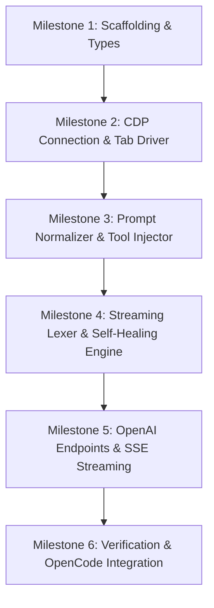

# Technical Implementation Plan & Milestones
## Gemini Web to OpenAI-Compatible Reverse Proxy

**Repository:** `kyleobrien91/gemini-web-openai-proxy`  
**Reference Document:** [`PRD.md`](./PRD.md)  
**Target Architecture:** Node.js (v20+) / TypeScript / Express / Native CDP WebSocket

---

## 1. Architectural Component Breakdown

```
src/
├── index.ts                      # App entrypoint & HTTP server lifecycle
├── config.ts                     # Environment variables & constants
│
├── types/
│   ├── openai.ts                 # OpenAI REST / SSE types (zod schemas)
│   ├── cdp.ts                    # CDP Protocol types & target schemas
│   └── tools.ts                  # Tool call structures & lexer states
│
├── cdp/
│   ├── connection.ts             # Discovers & manages WS connection to port 9222
│   ├── tab-manager.ts            # Manages dedicated Gemini Web tab lifecycle
│   ├── mode-switcher.ts          # Switches UI mode (3.7 Flash, 3.1 Pro, Flash-Lite)
│   └── stream-listener.ts        # Hooks Network/Fetch & extracts raw tokens
│
├── prompt/
│   ├── normalizer.ts             # Flattens multi-turn user/assistant/tool messages
│   └── tool-injector.ts          # Translates JSON Schema tools into XML directives
│
├── lexer/
│   ├── stream-lexer.ts           # 3-state streaming parser (TEXT, BUFFERING, TOOL)
│   ├── auto-repair.ts            # Tier 1 fast heuristic fixer (JSON5, unescaped quotes)
│   └── reflection.ts             # Tier 2 automated pushback turn generator
│
├── routes/
│   ├── models.ts                 # GET /v1/models handler
│   └── completions.ts            # POST /v1/chat/completions handler
│
└── utils/
    ├── sse.ts                    # OpenAI SSE chunk generator & formatter
    └── logger.ts                 # Structured logging
```

---

## 2. Phased Milestone Roadmap



---

### Milestone 1: Project Scaffolding & Type Definitions
**Goal:** Establish clean repository foundation, build pipeline, linting, and strict OpenAI / CDP type contracts.

- [x] **Task 1.1: Project Initialization** (Merged in PR #1)
- [x] **Task 1.2: Core Type Contracts (`src/types/`)** (Merged in PR #1)
- [x] **Task 1.3: Central Configuration (`src/config.ts`)** (Merged in PR #1)

---

### Milestone 2: CDP Connection Manager & Tab Lifecycle Driver
**Goal:** Connect to live Brave/Chrome instance, locate or launch a dedicated Gemini Web tab, and control model modes.

- [x] **Task 2.1: Target Discovery & WebSocket Manager (`src/cdp/connection.ts`)** (Merged in PR #1)
- [x] **Task 2.2: Tab Worker Lifecycle (`src/cdp/tab-manager.ts`)** (Merged in PR #1)
- [x] **Task 2.3: Model Mode Switcher (`src/cdp/mode-switcher.ts`)** (Merged in PR #1, refactored in PR #2)
- [x] **Task 2.4: Stream Capture Listener (`src/cdp/stream-listener.ts`)** (Merged in PR #1, hardened in PR #2)

---

### Milestone 3: Prompt Normalization & Tool Schema Injection
**Goal:** Flatten OpenAI multi-turn conversation arrays and serialize tool definitions into XML directives.

- [x] **Task 3.1: Tool Schema Injector (`src/prompt/tool-injector.ts`)** (Merged in PR #1, refined in PR #2)
- [x] **Task 3.2: Message History Serializer (`src/prompt/normalizer.ts`)** (Merged in PR #1, refined in PR #2)

---

### Milestone 4: Streaming Lexer & Two-Tier Self-Healing Engine
**Goal:** Parse live token streams into structured tool calls and automatically repair or reflect on formatting failures.

- [x] **Task 4.1: Streaming Lexer (`src/lexer/stream-lexer.ts`)** (Merged in PR #2, refactored to O(n) DFA in PR #3)
- [x] **Task 4.2: Tier 1 Fast Heuristic Auto-Repair (`src/lexer/auto-repair.ts`)** (Merged in PR #1 & #2)
- [x] **Task 4.3: Tier 2 Automated Reflection Pushback (`src/lexer/reflection.ts`)** (Merged in PR #1 & #2)

---

### Milestone 5: OpenAI REST Endpoints & SSE Streaming Pipeline
**Goal:** Expose fully compliant `/v1/models` and `/v1/chat/completions` HTTP endpoints.

- [x] **Task 5.1: SSE Chunk Generator (`src/utils/sse.ts`)** (Merged in PR #1 & #2)
- [x] **Task 5.2: Models Endpoint (`src/routes/models.ts` & `src/models/registry.ts`)** (Merged in PR #1 & #2)
- [x] **Task 5.3: Chat Completions Endpoint (`src/routes/completions.ts`)** (Merged in PR #1 & #2)

---

## 3. Current Live Roadmap: OpenCode MVP Operational Readiness

Tracked live in **Vikunja Project #5**: [Gemini Web OpenAI Proxy](http://192.168.45.105:3456/projects/5)

### Phase 2 MVP Runtime Hardening (Definition of Done for Coding with OpenCode)
- [ ] **[Task 15] DOM Stream Discontinuity & Code Block Hardening** `[MVP]` `[cdp-driver]` `[opencode-blocker]`: Guard `stream-listener.ts` against false-positive aborts during large code block emissions and UI re-renders.
- [ ] **[Task 16] Large Context & Quill Editor Input Reliability** `[MVP]` `[cdp-driver]`: Ensure long multi-turn prompts (10k-30k tokens with multiple files) paste into `.ql-editor` cleanly without browser tab freezes.

### Phase 4 Backlog (Post-MVP Enhancements)
- [ ] **[Task 17] Direct CDP Network/Fetch Stream Interception** `[phase-4]` `[cdp-driver]`: Replace DOM `MutationObserver` with raw HTTP/2 chunked RPC capture (`StreamGenerate` / `batchexecute`).
- [ ] **[Task 18] Extended Thinking Mode (gemini-3.7-flash-thinking)** `[phase-4]` `[cdp-driver]` `[api-routes]`: Register model, automate UI thinking toggle, and emit reasoning deltas.
- [ ] **[Task 19] Conversational Session Affinity (Delta Turns)** `[phase-4]` `[cdp-driver]` `[prompt-engine]`: Avoid full chat tab reloads on every turn during long agent tasks.
- [ ] **[Task 20] Tab Worker Pool Concurrency** `[phase-4]` `[cdp-driver]`: Multiplex concurrent requests across a pool of dedicated Gemini tabs.

### Testing & Tech Debt Backlog (Suspended Until After Phase 4)
> [!IMPORTANT]
> **TESTING SUSPENDED UNTIL AFTER PHASE 4:** Do not create, modify, or run tests. All verification must be performed strictly via `npm run build` and live runtime inspection.
- [ ] **[Task 13] Fix 5 Failing Unit Tests & Realign Contracts** `[tech-debt]` `[testing]` `[lexer-parser]`: Align `tests/lexer.test.ts`, `tests/sse.test.ts`, and `tests/normalizer.test.ts` to new DFA character emission and PR #2 contracts.
- [ ] **[Task 14] OpenCode Live Agent Loop Smoke Test** `[testing]` `[api-routes]`: End-to-end interactive test running OpenCode locally configured against `http://localhost:8000/v1` executing multi-step coding operations (read, edit, execute).


