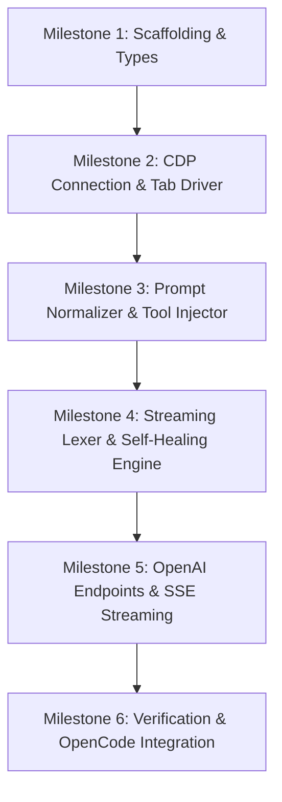

# Technical Implementation Plan & Milestones
## Gemini Web to OpenAI-Compatible Reverse Proxy

**Repository:** `kyleobrien91/gemini-web-openai-proxy`  
**Reference Document:** [`PRD.md`](./PRD.md)  
**Target Architecture:** Node.js (v20+) / TypeScript / Express / Native CDP WebSocket

---

## 1. Architectural Component Breakdown

```
src/
├── index.ts                      # App entrypoint & HTTP server lifecycle
├── config.ts                     # Environment variables & constants
│
├── types/
│   ├── openai.ts                 # OpenAI REST / SSE types (zod schemas)
│   ├── cdp.ts                    # CDP Protocol types & target schemas
│   └── tools.ts                  # Tool call structures & lexer states
│
├── cdp/
│   ├── connection.ts             # Discovers & manages WS connection to port 9222
│   ├── tab-manager.ts            # Manages dedicated Gemini Web tab lifecycle
│   ├── mode-switcher.ts          # Switches UI mode (3.7 Flash, 3.1 Pro, Flash-Lite)
│   └── stream-listener.ts        # Hooks Network/Fetch & extracts raw tokens
│
├── prompt/
│   ├── normalizer.ts             # Flattens multi-turn user/assistant/tool messages
│   └── tool-injector.ts          # Translates JSON Schema tools into XML directives
│
├── lexer/
│   ├── stream-lexer.ts           # 3-state streaming parser (TEXT, BUFFERING, TOOL)
│   ├── auto-repair.ts            # Tier 1 fast heuristic fixer (JSON5, unescaped quotes)
│   └── reflection.ts             # Tier 2 automated pushback turn generator
│
├── routes/
│   ├── models.ts                 # GET /v1/models handler
│   └── completions.ts            # POST /v1/chat/completions handler
│
└── utils/
    ├── sse.ts                    # OpenAI SSE chunk generator & formatter
    └── logger.ts                 # Structured logging
```

---

## 2. Phased Milestone Roadmap



---

### Milestone 1: Project Scaffolding & Type Definitions
**Goal:** Establish clean repository foundation, build pipeline, linting, and strict OpenAI / CDP type contracts.

- [ ] **Task 1.1: Project Initialization**
  - Create `package.json` with scripts (`build`, `start`, `dev`, `test`).
  - Configure `tsconfig.json` (`NodeNext`, strict mode, ESM/CJS output).
  - Install runtime dependencies: `express`, `cors`, `dotenv`, `zod`, `json5`.
  - Install dev dependencies: `typescript`, `@types/node`, `@types/express`, `@types/cors`, `vitest`, `tsx`.
- [ ] **Task 1.2: Core Type Contracts (`src/types/`)**
  - Define `OpenAIChatRequestSchema`, `OpenAIChatResponseSchema`, `OpenAIModelListSchema` using Zod.
  - Define SSE chunk delta interfaces (`ChatCompletionChunk`, `ToolCallDelta`).
  - Define CDP target objects and WebSocket event message payloads.
- [ ] **Task 1.3: Central Configuration (`src/config.ts`)**
  - Support `PORT` (default: 8000), `CDP_HOST` (127.0.0.1), `CDP_PORT` (9222), `REQUEST_TIMEOUT_MS` (60000), `MAX_RETRIES` (2).

---

### Milestone 2: CDP Connection Manager & Tab Lifecycle Driver
**Goal:** Connect to live Brave/Chrome instance, locate or launch a dedicated Gemini Web tab, and control model modes.

- [ ] **Task 2.1: Target Discovery & WebSocket Manager (`src/cdp/connection.ts`)**
  - Implement `discoverGeminiTarget()` querying `http://127.0.0.1:9222/json`.
  - Implement resilient WebSocket connection with auto-reconnection on socket drop.
  - Implement CDP message sender with unique request ID increments (`send(method, params)`).
- [ ] **Task 2.2: Tab Worker Lifecycle (`src/cdp/tab-manager.ts`)**
  - Ensure a clean Gemini chat tab is ready (`https://gemini.google.com/app`).
  - Implement `resetChatSession()` to navigate to `/app` or click the "New Chat" button between stateless turns.
- [ ] **Task 2.3: Model Mode Switcher (`src/cdp/mode-switcher.ts`)**
  - Implement DOM automation to query `bard-mode-menu-button`.
  - Click and switch to target model:
    - `gemini-3.7-flash` -> `bard-mode-option-56fdd199312815e2`
    - `gemini-3.1-pro` -> `bard-mode-option-e6fa609c3fa255c0`
    - `gemini-3.5-flash-lite` -> `bard-mode-option-8c46e95b1a07cecc`
    - Extended thinking toggle when `-thinking` model variant is requested.
- [ ] **Task 2.4: Stream Capture Listener (`src/cdp/stream-listener.ts`)**
  - Enable `Network.enable` and `Fetch.enable` for request interception.
  - Intercept `StreamGenerate` RPC / DOM text mutations and emit normalized raw token events.

---

### Milestone 3: Prompt Normalization & Tool Schema Injection
**Goal:** Flatten OpenAI multi-turn conversation arrays and serialize tool definitions into XML directives.

- [ ] **Task 3.1: Tool Schema Injector (`src/prompt/tool-injector.ts`)**
  - Convert OpenAI `tools` JSON Schema array into standard XML tool definitions block.
  - Format mandatory `<tool_call>` instructions and constraint rules.
- [ ] **Task 3.2: Message History Serializer (`src/prompt/normalizer.ts`)**
  - Parse `messages` array (`system`, `user`, `assistant`, `tool`).
  - Concatenate system instructions + tool definitions at top.
  - Replay past multi-turn history including previous tool executions and outputs (`[Tool Result (<tool_name>)]: ...`).
  - Append the latest user instruction at the bottom.

---

### Milestone 4: Streaming Lexer & Two-Tier Self-Healing Engine
**Goal:** Parse live token streams into structured tool calls and automatically repair or reflect on formatting failures.

- [ ] **Task 4.1: Three-State Streaming Lexer (`src/lexer/stream-lexer.ts`)**
  - State `TEXT`: Emit regular text deltas (`delta.content`).
  - State `BUFFERING`: Buffer candidate characters when detecting `<tool_call>` prefix.
  - State `TOOL_CALL`: Accumulate full `<tool_call>...</tool_call>` payload and emit structured OpenAI tool call deltas (`delta.tool_calls`).
  - Handle parallel consecutive `<tool_call>` blocks with incrementing `index`.
- [ ] **Task 4.2: Tier 1 Fast Heuristic Auto-Repair (`src/lexer/auto-repair.ts`)**
  - Strip accidental markdown wrappers (````json ... ````, ````xml ... ````).
  - Repair unclosed tags, fuzzy variations (`<tool>`, `<function_call>`).
  - Relaxed JSON parsing via JSON5 for unescaped internal quotes and newlines in bash/code arguments.
  - Convert titled code blocks (e.g. ````python file="..." ````) into synthetic `write_to_file` tool calls.
- [ ] **Task 4.3: Tier 2 Automated Reflection Pushback (`src/lexer/reflection.ts`)**
  - Detect non-recoverable formatting failures.
  - Inject automatic corrective user prompt into the active Gemini conversation thread.
  - Re-stream corrected output (capped at 2 retries) before graceful fallback.

---

### Milestone 5: OpenAI REST Endpoints & SSE Streaming Pipeline
**Goal:** Expose fully compliant `/v1/models` and `/v1/chat/completions` HTTP endpoints.

- [ ] **Task 5.1: SSE Chunk Generator (`src/utils/sse.ts`)**
  - Implement `createContentChunk(id, model, text)`
  - Implement `createToolHeaderChunk(id, model, index, toolId, toolName)`
  - Implement `createToolArgChunk(id, model, index, argFragment)`
  - Implement `createDoneChunk(id, model, finishReason)` (`"tool_calls"` vs `"stop"`)
  - Format `data: [DONE]\n\n`.
- [ ] **Task 5.2: Models Endpoint (`src/routes/models.ts`)**
  - Implement `GET /v1/models` returning all verified Gemini Web models (`3.7-flash`, `3.1-pro`, `3.5-flash-lite`, aliases).
- [ ] **Task 5.3: Chat Completions Endpoint (`src/routes/completions.ts`)**
  - Implement `POST /v1/chat/completions`.
  - Validate request body using Zod.
  - Route between streaming (SSE) and buffered non-streaming responses.
  - Handle client abort signals (`req.on('close')`) to disconnect CDP streams cleanly.

---

### Milestone 6: Verification, Integration Testing & Documentation
**Goal:** Validate end-to-end against OpenCode and provide turnkey runbook.

- [ ] **Task 6.1: Unit & Integration Test Suite**
  - Lexer unit tests covering fuzzy XML, code escaping, and parallel tool calls.
  - Prompt normalizer tests validating multi-turn history flattening.
  - Mock CDP stream integration tests.
- [ ] **Task 6.2: OpenCode Integration Validation**
  - Configure `~/.opencode/config.json` pointing to `http://127.0.0.1:8000/v1`.
  - Validate OpenCode multi-step coding loop (read file -> edit file -> run test).
- [ ] **Task 6.3: Developer Runbook & README**
  - Document prerequisites (Brave with `--remote-debugging-port=9222`).
  - Document build & launch steps (`npm run build && npm start`).
